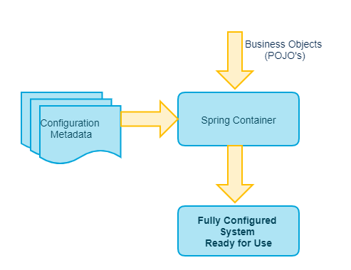

---

marp: true
title: Kubernetes
theme: utopios
paginate: true
author: Mohamed Aijjou
header: ""
footer: "Utopios® Tous droits réservés"

---

<!-- _class: lead -->
<!-- _paginate: false -->

# Spring, développer des applications d'entreprise

---

## Sommaire


1. Histoire de Spring : Origine et Évolution
2. Le conteneur Spring
3. Gestion des beans avec Spring Core et Spring boot.
4. Accès aux données et gestion des transactions
5. API REST avec Spring MVC et Spring WebFlux
6. IHM Web avec Spring MVC
7. Spring Security
8. Sécurité et détection d'attaques

</div>

---

<!-- _class: lead -->
<!-- _paginate: false -->

## Histoire de Spring : Origine et Évolution

---

## Histoire de Spring : Origine et Évolution

#### **Introduction :**

<br/>

<div style="font-size:30px">

- Spring est l’un des frameworks Java les plus influents et les plus utilisés. 
- Son développement a été motivé par des limitations perçues dans les technologies Java d'entreprise des années 2000.

</div>

---

## Histoire de Spring : Origine et Évolution

#### **Origines de Spring**


<div style="font-size:21px">
<br>

**Contexte des années 1990-2000** :
  - Les entreprises utilisaient largement **Java EE** (Java 2 Platform, Enterprise Edition, ou J2EE) pour développer des applications d'entreprise.
  - J2EE avait une approche rigide, centrée sur les EJB (Enterprise JavaBeans), avec une gestion complexe des transactions, des dépendances, et un développement fortement couplé au conteneur d'exécution.
  <br>

**Les limitations de J2EE** :
  - **Complexité** : Le développement avec J2EE nécessitait beaucoup de code "verbeux" pour accomplir des tâches simples.
  - **Rigidité** : Les applications étaient fortement liées au conteneur d'application, ce qui rendait le test en isolation difficile.
  - **Manque de flexibilité** : Les EJB imposaient une structure contraignante, rendant difficile l'adoption d'autres solutions comme Hibernate pour la persistance.


</div>


---

## Histoire de Spring : Origine et Évolution

#### **Origines de Spring**

<div style="font-size:26px">
<br>

**Naissance de Spring** :
  - **Rod Johnson**, un développeur Java et auteur australien, a critiqué ces limitations dans son livre *"Expert One-on-One J2EE Design and Development"* publié en 2002.
  - Dans ce livre, il a présenté un framework léger basé sur des concepts comme l'**Inversion de Contrôle (IoC)** et l'**Injection de Dépendances (DI)**, qui deviendrait la base de Spring.
  - La première version de Spring Framework a été publiée en 2003 sous licence Apache 2.0.


</div>


---

## Histoire de Spring : Origine et Évolution

#### **Croissance et Adoption (2003-2010)**

<div style="font-size:21px">
<br>

**Version 1.0 (2004)** :
  - La version 1.0 de Spring Framework a introduit des fonctionnalités clés comme :
    - **IoC Container** : Gestion des dépendances via XML.
    - **AOP (Aspect-Oriented Programming)** : Gestion des préoccupations transversales comme les transactions et le logging.
    - **Abstraction JDBC** : Simplification de l'accès aux bases de données.
  - Spring est rapidement adopté par les développeurs frustrés par la complexité de J2EE.

<br>

**Support pour Hibernate** :
  - L'intégration avec Hibernate a permis de simplifier l'accès aux bases de données.
  - Cela a renforcé l'attractivité de Spring auprès des développeurs cherchant une alternative à l'approche rigide des EJB.


</div>


---

## Histoire de Spring : Origine et Évolution

#### **Croissance et Adoption (2003-2010)**

<div style="font-size:24px">
<br>

**Version 2.0 (2006)** :
  - Introduction de nouvelles fonctionnalités :
    - Gestion améliorée des **annotations** pour réduire les configurations XML.
    - Introduction du concept de **Spring Modules**, permettant une modularité accrue.
    - Améliorations dans l'intégration avec d'autres frameworks, comme Struts et JSF pour les applications web.
<br>

**Compétition avec Java EE** :
  - Java EE a commencé à simplifier ses API avec des annotations dans les EJB 3.0, mais Spring a maintenu son avantage grâce à sa flexibilité et à son approche légère.


</div>


---

## Histoire de Spring : Origine et Évolution

#### **L'Ère de Spring Boot (2010-présent)**

<div style="font-size:27px">
<br>

**Contexte des années 2010** :
  - L'industrie évolue vers les **microservices** et les **applications cloud-native**.
  - Les développeurs cherchent à éviter les tâches répétitives de configuration et à accélérer le développement.

<br>

**Version 3.0 (2009)** :
  - Support des **annotations Java 5** pour réduire davantage la configuration XML.
  - Intégration des standards Java EE comme JPA 2.0, Bean Validation, et RESTful services.


</div>
---

## Histoire de Spring : Origine et Évolution

#### **Spring Aujourd'hui : Écosystème et Réalité Moderne**

<div style="font-size:21px">
<br>

**Introduction de Spring Boot (2014)** :
  - Spring Boot, une extension de Spring Framework, est lancé pour simplifier et accélérer le développement d'applications Java.
  - **Fonctionnalités clés** :
    - **Dépendances pré-configurées** : Starters Maven/Gradle.
    - **Configuration automatique** pour les bases de données, serveurs web, etc.
    - Serveurs web intégrés comme Tomcat ou Jetty.
    - Possibilité de créer des applications packagées en **fichiers JAR exécutables**.

<br>

**Adoption massive** :
  - Spring Boot a révolutionné le développement Java d'entreprise, devenant un choix incontournable pour les microservices et les applications cloud-native.


</div>


---

## Histoire de Spring : Origine et Évolution

#### **L'Ère de Spring Boot (2010-présent)**

<div style="font-size:21px">
<br>

**Spring Framework 5 (2017)** :
  - Introduction de **Spring WebFlux**, un module réactif basé sur Project Reactor, pour supporter les architectures asynchrones et non-bloquantes.
  - Support de **Java 8+** pour tirer parti des lambdas et des Streams.

<br>

**Écosystème Spring** :
  - Spring est devenu bien plus qu'un simple framework :
    - **Spring Data** : Simplifie l'accès aux bases de données SQL et NoSQL.
    - **Spring Security** : Fournit des outils puissants pour sécuriser les applications.
    - **Spring Cloud** : Une suite de solutions pour développer et déployer des applications cloud-native.
    - **Spring Batch** : Support pour les tâches de traitement par lots.
    - **Spring Integration** : Facilite l'intégration des systèmes.

</div>

---

## Histoire de Spring : Origine et Évolution

#### **L'Ère de Spring Boot (2010-présent)**

<div style="font-size:28px">

<br>

**Support pour les nouvelles tendances** :
  - Spring continue d’évoluer pour répondre aux besoins modernes :
    - Développement de **microservices**.
    - Intégration avec **Docker**, **Kubernetes**, et les plateformes cloud comme AWS, Azure, et Google Cloud.
    - Support des paradigmes réactifs pour des applications haute performance.

</div>

---

## Histoire de Spring : Origine et Évolution

#### **Impact de Spring**

<div style="font-size:35px">
<br>


Spring a transformé le paysage du développement Java en :
- Simplifiant le développement d'applications complexes.
- Rendant Java compétitif face à d'autres langages comme Python, Node.js, ou Go.
- Permettant une adoption massive des microservices et des architectures modernes.

</div>

---


<!-- _class: lead -->
<!-- _paginate: false -->

## Le conteneur Spring

---


## Le conteneur Spring

#### **Fonctionnement général du conteneur Spring**

<br>
<div style="font-size:28px">

**Le conteneur IoC (Inversion of Control)** :
  - Le conteneur Spring est responsable de :
    - **Gérer le cycle de vie des objets (Beans)**.
    - **Configurer et assembler automatiquement les dépendances**.
    - Fournir un **contexte d'exécution cohérent** pour les composants de l'application.
  - Principe clé : L'application ne crée pas elle-même ses dépendances ; elles sont injectées par le conteneur.

</div>

---

## Le conteneur Spring

#### **Fonctionnement général du conteneur Spring**

<br>
<div style="font-size:21px">

**Processus de fonctionnement** :
  1. **Déclaration des Beans** :
     - Les composants sont définis dans un fichier de configuration XML, des annotations ou via une classe de configuration Java.
  2. **Chargement du conteneur** :
     - Le conteneur lit les définitions des Beans et crée une instance pour chaque Bean, selon la portée définie.
  3. **Injection de dépendances** :
     - Les dépendances sont résolues et injectées dans les Beans (via constructeur, setter ou annotations).
  4. **Gestion du cycle de vie** :
     - Les Beans peuvent être initialisés, détruits ou recréés en fonction de leur portée.
</div>

---

## Le conteneur Spring

#### **Fonctionnement général du conteneur Spring**

<br>
<div style="font-size:29px">

**Types de conteneurs** :
  - **BeanFactory** : Conteneur minimaliste offrant les fonctionnalités de base de l'IoC.
  - **ApplicationContext** : Extension du BeanFactory, avec des fonctionnalités avancées comme l'internationalisation, la gestion des événements et l'intégration avec les frameworks web.
</div>

---

## Le conteneur Spring

#### **Fonctionnement général du conteneur Spring**


<div style="font-size:29px">

<center>

</center>

</div>

---

## Le conteneur Spring

#### **Spring dans l'écosystème Jakarta EE**


<div style="font-size:25px">

<br>

**Jakarta EE : Définition et évolution**
  - Anciennement Java EE, Jakarta EE est un ensemble de spécifications pour le développement d'applications d'entreprise.
  - Principales spécifications : JPA, JAX-RS, CDI, JMS, Servlet, etc.
  - Fonctionnement basé sur des serveurs d’applications comme WildFly, Payara, et TomEE.
<br>

**Spring : Complément ou alternative ?**
  - Spring est souvent utilisé comme alternative légère et modulaire à Jakarta EE.
  - Spring Boot permet de créer des applications sans dépendre d’un serveur d'applications Jakarta EE, tout en supportant ses spécifications clés.
</div>

---

## Le conteneur Spring

#### **Spring dans l'écosystème Jakarta EE**

<div style="font-size:22px">

#### **a. JPA (Jakarta Persistence API)**
- **Utilisation avec Spring Data JPA :**
  - Jakarta EE définit JPA pour la persistance des données relationnelles.
  - Spring intègre JPA via Spring Data JPA, qui simplifie l’interaction avec les bases de données.
  - Exemple d’intégration :
    ```java
    @Entity
    public class Product {
        @Id
        @GeneratedValue
        private Long id;
        private String name;
    }

    @Repository
    public interface ProductRepository extends JpaRepository<Product, Long> { }
    ```
</div>

---

## Le conteneur Spring

#### **Spring dans l'écosystème Jakarta EE**

<div style="font-size:25px">

#### **a. JPA (Jakarta Persistence API)**
- **Gestion des transactions avec Spring :**
  - Utilisation de l'annotation `@Transactional`.
  - Spring offre une abstraction plus flexible pour gérer les transactions.
    ```java
    @Service
    public class ProductService {
        @Transactional
        public void saveProduct(Product product) {
            productRepository.save(product);
        }
    }
    ```
</div>

---

## Le conteneur Spring

#### **Spring dans l'écosystème Jakarta EE**

<div style="font-size:23px">

#### **b. JAX-RS (Jakarta RESTful Web Services)**
- **Spring Web MVC vs JAX-RS :**
  - Jakarta EE propose JAX-RS pour développer des API REST.
  - Spring propose Spring Web MVC qui couvre les mêmes fonctionnalités, mais avec une approche plus intégrée dans l’écosystème Spring.
  - Exemple avec Spring Web MVC :
    ```java
    @RestController
    @RequestMapping("/products")
    public class ProductController {
        @GetMapping
        public List<Product> getAllProducts() {
            return productService.getAllProducts();
        }
    }
    ```

- **Interopérabilité :**
  - Il est possible d’utiliser des implémentations JAX-RS comme Jersey ou RestEasy avec Spring Boot.
</div>

---
## Le conteneur Spring

#### **Spring dans l'écosystème Jakarta EE**

<div style="font-size:23px">

#### **c. JMS (Jakarta Messaging Services)**
- **Spring JMS :**
  - Jakarta EE utilise JMS pour la communication asynchrone avec des files d’attente (queues) ou des sujets (topics).
  - Spring JMS fournit une abstraction simplifiée pour interagir avec JMS.
  - Exemple avec Spring JMS :
    ```java
    @Component
    public class MessageListener {
        @JmsListener(destination = "order-queue")
        public void processOrder(String message) {
            System.out.println("Received message: " + message);
        }
    }
    ```
</div>

---

## Le conteneur Spring

#### **Spring dans l'écosystème Jakarta EE**

<div style="font-size:29px">

<br>

#### **d. Servlet (Jakarta Servlet API)**
- Spring repose sur la spécification Jakarta Servlet pour gérer les requêtes HTTP.
- Exemple d’utilisation :
  - Spring Boot utilise le conteneur servlet intégré comme Tomcat ou Jetty.

</div>

---

## Le conteneur Spring

#### **Spring dans l'écosystème Jakarta EE**

<div style="font-size:25px">


### Déploiement dans des environnements Jakarta EE**
- **Spring dans un serveur d'applications Jakarta EE :**
  - Les applications Spring peuvent être déployées dans des serveurs Jakarta EE comme WildFly, Payara, ou TomEE.
  - Les fichiers `application.properties` ou `application.yml` permettent une configuration flexible adaptée au déploiement.

- **Spring Boot comme alternative autonome :**
  - Spring Boot propose un conteneur intégré (Tomcat, Jetty) qui rend inutile l’utilisation d’un serveur Jakarta EE.
  - Cela simplifie le développement et le déploiement des applications.
</div>

---

## Le conteneur Spring

#### **Spring dans l'écosystème Jakarta EE**

| **Aspect**              | **Spring**                                              | **Jakarta EE**                                          |
|-------------------------|-------------------------------------------------------|-------------------------------------------------------|
| **Configuration**       | Flexible (annotations, Java, YAML, XML)                | Basé sur XML et annotations standardisées             |
| **Conteneur**           | Léger, intégré (Tomcat, Jetty)                          | Dépend d’un serveur d’applications                   |
| **Communauté**          | Actif, nombreuses extensions et plugins                | Basé sur des standards, moins rapide à évoluer        |
| **Abstraction**         | Plus riche (Spring Data, Spring Security)              | Moins d’abstractions, plus près des spécifications    |
| **Approche**            | Modularité, convention plutôt que configuration       | Standards, nécessite souvent des configurations       |


---

### Le conteneur Spring


#### Les composants essentiels : Core, accès aux données, WebMVC.

<div style="font-size:20px">

### **1. Spring Core**
Le module **Core** constitue le cœur du framework Spring. Il fournit les fonctionnalités fondamentales utilisées par tous les autres modules.

#### **a. Conteneur IoC (Inversion of Control)**
- **Concept :**
  - Gestion des objets (appelés Beans) et de leurs dépendances par le conteneur Spring.
  - Principe de l’injection de dépendances (DI).
- **Fonctionnalités clés :**
  - Instanciation des Beans.
  - Gestion du cycle de vie des Beans.
  - Résolution des dépendances entre Beans.

</div>

---

### Le conteneur Spring


#### Les composants essentiels : Core, accès aux données, WebMVC.

<div style="font-size:25px">

### **1. Spring Core**
Le module **Core** constitue le cœur du framework Spring. Il fournit les fonctionnalités fondamentales utilisées par tous les autres modules.

#### **a. Conteneur IoC (Inversion of Control)**
- **Annotations courantes :**
  - `@Component`, `@Service`, `@Repository`, `@Controller` : Déclarer les Beans dans le conteneur.
  - `@Autowired` : Injecter les dépendances automatiquement.
  - `@Qualifier` : Résoudre les conflits de Beans.

</div>

---

### Le conteneur Spring


#### Les composants essentiels : Core, accès aux données, WebMVC.

<div style="font-size:17px">

### **1. Spring Core**
Le module **Core** constitue le cœur du framework Spring. Il fournit les fonctionnalités fondamentales utilisées par tous les autres modules.

#### **b. Gestion des configurations**
- Approches disponibles :
  - **XML Configuration** (ancienne méthode, encore supportée).
  - **Java Configuration** : Utilisation de classes annotées avec `@Configuration`.
    ```java
    @Configuration
    public class AppConfig {
        @Bean
        public MyService myService() {
            return new MyServiceImpl();
        }
    }
    ```
  - **Annotations** : Détection automatique des composants via `@ComponentScan`.
</div>

---

### Le conteneur Spring


#### Les composants essentiels : Core, accès aux données, WebMVC.

<div style="font-size:16px">

### **1. Spring Core**
Le module **Core** constitue le cœur du framework Spring. Il fournit les fonctionnalités fondamentales utilisées par tous les autres modules.

#### **c. Gestion des événements**
- Permet la communication entre différents composants au sein du conteneur Spring.
- Exemple avec un événement personnalisé :
  ```java
  public class CustomEvent extends ApplicationEvent {
      public CustomEvent(Object source) {
          super(source);
      }
  }

  @Component
  public class CustomEventListener {
      @EventListener
      public void handleCustomEvent(CustomEvent event) {
          System.out.println("Custom event received: " + event.getSource());
      }
  }
  ```
</div>

---

### Le conteneur Spring


#### Les composants essentiels : Core, accès aux données, WebMVC.

<div style="font-size:16px">

### **2. Spring pour l’Accès aux Données**
Spring facilite l’interaction avec les bases de données grâce à des abstractions puissantes.

#### **a. JDBC Template**
- Simplifie l’utilisation de JDBC (Java Database Connectivity).
- Élimine le besoin de gérer manuellement les connexions et exceptions.
- Exemple :
  ```java
  @Repository
  public class UserRepository {
      private final JdbcTemplate jdbcTemplate;

      public UserRepository(JdbcTemplate jdbcTemplate) {
          this.jdbcTemplate = jdbcTemplate;
      }

      public List<User> findAll() {
          return jdbcTemplate.query("SELECT * FROM users", new BeanPropertyRowMapper<>(User.class));
      }
  }
  ```
</div>

---

### Le conteneur Spring


#### Les composants essentiels : Core, accès aux données, WebMVC.

<div style="font-size:18px">

### **2. Spring pour l’Accès aux Données**
Spring facilite l’interaction avec les bases de données grâce à des abstractions puissantes.

#### **b. ORM avec Spring Data JPA**
- Fournit une intégration avec JPA (Jakarta Persistence API).
- Simplifie la création de repositories grâce aux interfaces.
- Exemple avec une entité et un repository :
  ```java
  @Entity
  public class Product {
      @Id
      @GeneratedValue
      private Long id;
      private String name;
  }

  public interface ProductRepository extends JpaRepository<Product, Long> { }
  ```
</div>

---

### Le conteneur Spring

#### Les composants essentiels : Core, accès aux données, WebMVC.

<div style="font-size:19px">

### **2. Spring pour l’Accès aux Données**
Spring facilite l’interaction avec les bases de données grâce à des abstractions puissantes.

#### **c. Gestion des Transactions**
- Spring gère les transactions via l’annotation `@Transactional`.
- Exemple :
  ```java
  @Service
  public class OrderService {
      @Transactional
      public void placeOrder(Order order) {
          orderRepository.save(order);
          paymentService.processPayment(order);
      }
  }
  ```
</div>

---

### Le conteneur Spring


#### Les composants essentiels : Core, accès aux données, WebMVC.

<div style="font-size:22px">

### **2. Spring pour l’Accès aux Données**
Spring facilite l’interaction avec les bases de données grâce à des abstractions puissantes.

#### **d. Cache intégré**
- Support pour le caching avec des annotations comme `@Cacheable` et `@CacheEvict`.
- Exemple :
  ```java
  @Service
  public class ProductService {
      @Cacheable("products")
      public Product findProductById(Long id) {
          return productRepository.findById(id).orElseThrow();
      }
  }
  ```
</div>

---

### Le conteneur Spring


#### Les composants essentiels : Core, accès aux données, WebMVC.

<div style="font-size:14px">

### **3. Spring WebMVC**
Le module **WebMVC** est conçu pour développer des applications web, principalement RESTful, avec une architecture basée sur le modèle MVC (Model-View-Controller).

#### **a. Composants principaux de Spring WebMVC**
1. **Controller :**
   - Reçoit les requêtes HTTP et appelle les services appropriés.
   - Exemple avec un contrôleur REST :
     ```java
     @RestController
     @RequestMapping("/products")
     public class ProductController {
         private final ProductService productService;

         public ProductController(ProductService productService) {
             this.productService = productService;
         }

         @GetMapping
         public List<Product> getAllProducts() {
             return productService.findAll();
         }
     }
     ```

</div>

---

### Le conteneur Spring


#### Les composants essentiels : Core, accès aux données, WebMVC.

<div style="font-size:17px">

### **3. Spring WebMVC**

#### **a. Composants principaux de Spring WebMVC**
2. **Service :**
   - Contient la logique métier, appel des repositories et gestion des règles spécifiques.
   - Exemple :
     ```java
     @Service
     public class ProductService {
         private final ProductRepository productRepository;

         public ProductService(ProductRepository productRepository) {
             this.productRepository = productRepository;
         }

         public List<Product> findAll() {
             return productRepository.findAll();
         }
     }
     ```
</div>

---

### Le conteneur Spring


#### Les composants essentiels : Core, accès aux données, WebMVC.

<div style="font-size:30px">

### **3. Spring WebMVC**

#### **a. Composants principaux de Spring WebMVC**
3. **View :**
   - Renvoie les réponses HTTP (HTML, JSON, XML, etc.).
   - Dans les applications REST, les vues sont remplacées par des réponses JSON ou XML via des librairies comme Jackson.
</div>

---
### Le conteneur Spring


#### Les composants essentiels : Core, accès aux données, WebMVC.

<div style="font-size:23px">

### **3. Spring WebMVC**

#### **b. Gestion des routes**
- Configuration des routes avec les annotations `@RequestMapping`, `@GetMapping`, `@PostMapping`, etc.
- Exemple :
  ```java
  @RestController
  @RequestMapping("/users")
  public class UserController {
      @GetMapping("/{id}")
      public User getUser(@PathVariable Long id) {
          return userService.findById(id);
      }
  }
  ```
</div>

---

### Le conteneur Spring


#### Les composants essentiels : Core, accès aux données, WebMVC.

<div style="font-size:25px">

### **3. Spring WebMVC**

#### **c. Validation des entrées**
- Utilisation des annotations de validation comme `@Valid` et des contraintes comme `@NotNull`, `@Size`.
- Exemple :
  ```java
  @PostMapping
  public ResponseEntity<User> createUser(@Valid @RequestBody User user) {
      return ResponseEntity.ok(userService.save(user));
  }
  ```
</div>

---

### Le conteneur Spring


#### Les composants essentiels : Core, accès aux données, WebMVC.

<div style="font-size:25px">

### **3. Spring WebMVC**

#### **d. Gestion des exceptions**
- Centralisation de la gestion des exceptions avec `@ControllerAdvice`.
- Exemple :
  ```java
  @ControllerAdvice
  public class GlobalExceptionHandler {
      @ExceptionHandler(ResourceNotFoundException.class)
      public ResponseEntity<String> handleResourceNotFound(ResourceNotFoundException ex) {
          return ResponseEntity.status(HttpStatus.NOT_FOUND).body(ex.getMessage());
      }
  }
  ```
</div>

---

### Le conteneur Spring


#### Les composants essentiels : Core, accès aux données, WebMVC.

<div style="font-size:26px">

### **3. Spring WebMVC**

#### **e. Support des formats multiples**
- Spring WebMVC supporte automatiquement JSON, XML, et HTML en fonction du `Content-Type` de la requête.
- Exemple avec JSON (via Jackson) :
  ```java
  @GetMapping("/product/{id}")
  public Product getProduct(@PathVariable Long id) {
      return productService.findProductById(id);
  }
  ```
</div>

---

### Le conteneur Spring


#### L'intégration aux autres technologies

<div style="font-size:27px">

<br>

**Spring : Un framework intégrateur**
  - Spring est conçu pour être extensible et interopérable avec d'autres technologies.
  - Permet de simplifier l'utilisation de bibliothèques complexes grâce à des abstractions.

<br>

**Avantages de l’intégration avec Spring :**
  - Configuration simplifiée.
  - Support natif pour plusieurs technologies via des modules spécialisés.
  - Flexibilité pour ajouter ou remplacer des technologie

</div>

---

### Le conteneur Spring


#### L'intégration aux autres technologies

<div style="font-size:30px">

<br>

### **1. Bases de données**
- **JDBC** : Simplifié via `JdbcTemplate` pour éviter la gestion manuelle des connexions.
- **Spring Data JPA** : Intégration avec JPA pour la persistance relationnelle via des repositories simples.
- **NoSQL** : Support pour MongoDB, Redis, Cassandra avec Spring Data.
  ```java
  public interface CustomerRepository extends MongoRepository<Customer, String> {}
  ```
</div>

---


### Le conteneur Spring


#### L'intégration aux autres technologies

<div style="font-size:25px">

### **2. Frameworks web**
- **Spring WebMVC** : Architecture RESTful et MVC avec annotations comme `@Controller` et `@RestController`.
- **Thymeleaf** : Génération dynamique des vues HTML.
- **WebFlux** : Support des applications réactives non bloquantes.
  ```java
  @RestController
  public class ReactiveController {
      @GetMapping("/flux")
      public Flux<String> getFlux() {
          return Flux.just("Spring", "WebFlux", "Reactivity");
      }
  }
  ```
</div>

---

### Le conteneur Spring


#### L'intégration aux autres technologies

<div style="font-size:30px">

### **3. Messagerie**
- **JMS** : Gestion des files d'attente avec `@JmsListener`.
- **Kafka** : Support via Spring Kafka pour produire et consommer des messages.
  ```java
  @KafkaListener(topics = "topicName", groupId = "groupId")
  public void listen(String message) {
      System.out.println("Received: " + message);
  }
  ```

</div>

---

### Le conteneur Spring


#### L'intégration aux autres technologies

<div style="font-size:30px">

### **4. Sécurité**
- **Spring Security** : Authentification, autorisation, gestion des sessions.
- **OAuth2/OpenID Connect** : Gestion simplifiée des autorisations via Spring Security OAuth2.
  ```java
  http.oauth2Login();
  ```

</div>

---

### Le conteneur Spring


#### L'intégration aux autres technologies

<div style="font-size:30px">

### **5. Cloud et DevOps**
- **Spring Cloud** : Services comme Eureka (discovery), Config Server (configurations centralisées), Gateway API.
- **AWS/GCP** : Intégration avec des services cloud (S3, DynamoDB, Pub/Sub).
  ```java
  amazonS3.putObject(bucketName, fileName, input, new ObjectMetadata());
  ```

</div>

---

### Le conteneur Spring


#### L'intégration aux autres technologies

<div style="font-size:22px">

### **6. Monitoring et logging**
- **Spring Boot Actuator** : Points d’accès pour la surveillance (santé, métriques).
- **Prometheus/Grafana** : Exportation des métriques pour le monitoring.
  ```plaintext
  /actuator/health
  ```
- Exportation des métriques pour Prometheus.
- Exemple :
  ```java
  @RestController
  @RequestMapping("/metrics")
  public class MetricsController {
      @GetMapping("/custom")
      public String customMetric() {
          return "Custom metric for monitoring";
      }
  }
  ```

</div>

---

### Le conteneur Spring


#### L'intégration aux autres technologies

<div style="font-size:30px">

### **7. Tests**
- **JUnit et Mockito** : Tests unitaires avec mocks.
- **Spring Boot Test** : Tests d’intégration avec le contexte Spring.
  ```java
  @SpringBootTest
  public class ApplicationTests {
      @Test
      void contextLoads() { }
  }
  ```
</div>

---

### Le conteneur Spring


#### L'intégration aux autres technologies

<div style="font-size:30px">

### **8. ESB et SOA**
- **Apache Camel** : Intégration et orchestration des services.
- Exemple :
  ```java
  @Component
  public class MyRoute extends RouteBuilder {
      @Override
      public void configure() {
          from("direct:start")
              .to("log:myLogger");
      }
  }
  ```

</div>

---

### Le conteneur Spring


#### L’apport de Spring Boot

<br>

<div style="font-size:35px">

Spring Boot simplifie le développement d’applications Spring en réduisant les efforts de configuration et en favorisant une approche conventionnelle avec des valeurs par défaut optimales.

</div>

---

### Le conteneur Spring


#### L’apport de Spring Boot

<br>

<div style="font-size:27px">

### **1. Gestion des dépendances Maven**
- **Starter Dependencies :** 
  - Spring Boot introduit des **"starters"**, des dépendances préconfigurées pour intégrer rapidement des technologies.
  - Exemple : 
    - `spring-boot-starter-web` : Inclut Spring MVC, Tomcat, et JSON (via Jackson).
    - `spring-boot-starter-data-jpa` : Inclut Hibernate, Spring Data JPA, et un connecteur de base de données.

</div>

---

### Le conteneur Spring


#### L’apport de Spring Boot

<div style="font-size:19px">

### **1. Gestion des dépendances Maven**
- **Simplification de la gestion des versions :**
  - Spring Boot utilise un **parent POM** (`spring-boot-starter-parent`) qui gère les versions compatibles des dépendances.
  - Cela évite les conflits de version dans le projet.
  - Exemple de configuration Maven :
    ```xml
    <parent>
        <groupId>org.springframework.boot</groupId>
        <artifactId>spring-boot-starter-parent</artifactId>
        <version>3.1.4</version>
    </parent>

    <dependencies>
        <dependency>
            <groupId>org.springframework.boot</groupId>
            <artifactId>spring-boot-starter-web</artifactId>
        </dependency>
    </dependencies>
    ```
</div>

---

### Le conteneur Spring


#### L’apport de Spring Boot

<div style="font-size:24px">

### **1. Gestion des dépendances Maven**
- **Personnalisation via un BOM (Bill of Materials) :**
  - Permet de gérer les versions des dépendances dans un fichier centralisé.
    ```xml
    <dependencyManagement>
        <dependencies>
            <dependency>
                <groupId>org.springframework.boot</groupId>
                <artifactId>spring-boot-dependencies</artifactId>
                <version>3.1.4</version>
                <type>pom</type>
                <scope>import</scope>
            </dependency>
        </dependencies>
    </dependencyManagement>
    ```
</div>

---
### Le conteneur Spring


#### L’apport de Spring Boot

<div style="font-size:19px">

### **2. Configuration automatique**
- **Principe :**
  - Spring Boot analyse les dépendances du projet et configure automatiquement les composants requis.
  - Remplace les fichiers XML et réduit les annotations nécessaires.

- **Annotations clés :**
  - `@SpringBootApplication` : Combinaison de :
    - `@Configuration` : Indique que la classe contient des Beans configurés.
    - `@EnableAutoConfiguration` : Active la configuration automatique en fonction des dépendances.
    - `@ComponentScan` : Recherche les composants dans le package actuel et ses sous-packages.

  ```java
  @SpringBootApplication
  public class MyApplication {
      public static void main(String[] args) {
          SpringApplication.run(MyApplication.class, args);
      }
  }
  ```
</div>

---

### Le conteneur Spring


#### L’apport de Spring Boot

<div style="font-size:24px">

### **2. Configuration automatique**
- **Exemples de configuration automatique :**
  - **Base de données :**
    - Si `spring-boot-starter-data-jpa` est inclus et une base de données est détectée (par ex., H2 ou PostgreSQL), Spring configure automatiquement :
      - Le DataSource.
      - Hibernate.
    - Exemple de fichier `application.properties` :
      ```properties
      spring.datasource.url=jdbc:h2:mem:testdb
      spring.datasource.driver-class-name=org.h2.Driver
      spring.jpa.hibernate.ddl-auto=update
      ```

</div>

---


### Le conteneur Spring


#### L’apport de Spring Boot

<div style="font-size:24px">

### **2. Configuration automatique**
- **Exemples de configuration automatique :**
  - **Serveur Web :**
    - Inclusion de `spring-boot-starter-web` :
      - Configure automatiquement Tomcat comme serveur web embarqué.
      - Gère les endpoints REST.
    - Par défaut, l'application démarre sur `http://localhost:8080`.

- **Désactivation ou personnalisation :**
  - Si besoin, certaines configurations automatiques peuvent être désactivées avec `@EnableAutoConfiguration(exclude = ...)`.

</div>

---

### Le conteneur Spring


#### L’apport de Spring Boot

<div style="font-size:24px">

### **Bénéfices concrets de Spring Boot**
1. **Productivité accrue :**
   - Réduction du temps de configuration.
   - Prise en charge rapide de fonctionnalités complexes grâce aux starters.
2. **Flexibilité :**
   - Possibilité de personnaliser les configurations prédéfinies via des fichiers de propriétés ou des classes Java.
3. **Cohérence :**
   - Les starters garantissent des versions compatibles des bibliothèques utilisées.

</div>

---

### Le conteneur Spring


#### L’environnement de développement de Spring

<div style="font-size:19px">

### **1. Prérequis techniques**
#### **a. Outils nécessaires**
- **JDK (Java Development Kit) :**
  - Version recommandée : **Java 17+** (compatibilité avec Spring Boot 3.x).
  - Configuration de la variable `JAVA_HOME` :
    ```bash
    export JAVA_HOME=/path/to/jdk
    export PATH=$JAVA_HOME/bin:$PATH
    ```

- **Maven ou Gradle :**
  - Maven (gestionnaire de dépendances recommandé pour Spring) :
    - Installer Maven : [Téléchargement Maven](https://maven.apache.org/download.cgi).
    - Vérification de l’installation :
      ```bash
      mvn -v
      ```
  - Gradle : Option alternative, adaptée pour les projets modernes.
</div>

---

### Le conteneur Spring


#### L’environnement de développement de Spring

<div style="font-size:22px">

### **1. Prérequis techniques**
- **IDE (Integrated Development Environment) :**
  - **IntelliJ IDEA (recommandé)** :
    - Support natif pour Spring et Spring Boot.
    - Inclut des outils comme Spring Initializr pour la création rapide de projets.
  - **Eclipse avec STS (Spring Tool Suite)** :
    - Extension officielle de Spring pour Eclipse.
  - VS Code avec les extensions **Spring Boot** et **Java**.

#### **b. Serveur intégré**
- Spring Boot inclut des serveurs web embarqués comme Tomcat, Jetty ou Undertow, éliminant la nécessité d’un serveur externe.
</div>

---

### Le conteneur Spring


#### L’environnement de développement de Spring

<div style="font-size:21px">

### **2. Création rapide d’un projet Spring**
#### **a. Spring Initializr**
- **Interface web :**
  - Disponible sur [start.spring.io](https://start.spring.io).
  - Permet de générer un projet Spring Boot avec les dépendances nécessaires.
- **Dans l’IDE :**
  - IntelliJ IDEA et STS permettent de générer un projet Spring directement depuis l’IDE.

- **Paramètres courants à configurer :**
  - **Group** : Identifiant du package principal (ex. `com.example`).
  - **Artifact** : Nom du projet.
  - **Dependencies** : Ajout des starters nécessaires (ex. `Spring Web`, `Spring Data JPA`).

</div>

---

### Le conteneur Spring


#### L’environnement de développement de Spring

<div style="font-size:28px">

### **2. Création rapide d’un projet Spring**
#### **b. Commande Maven**
- Création d’un projet Maven depuis la ligne de commande :
  ```bash
  mvn archetype:generate -DgroupId=com.example -DartifactId=myapp \
      -DarchetypeArtifactId=maven-archetype-quickstart -DinteractiveMode=false
  ```
  
</div>

---

### Le conteneur Spring


#### L’environnement de développement de Spring

<div style="font-size:26px">

### **3. Organisation d’un projet Spring**
#### **Structure typique d’un projet**
```plaintext
src/
├── main/
│   ├── java/                       # Code source Java
│   │   └── com/example/myapp/
│   │       ├── MyAppApplication.java
│   │       ├── controller/
│   │       ├── service/
│   │       └── repository/
│   └── resources/                  # Fichiers de configuration
│       ├── application.properties
│       └── static/                 # Contenu statique (HTML, CSS, JS)
├── test/                           # Tests unitaires et d’intégration
```

</div>

---

### Le conteneur Spring


#### L’environnement de développement de Spring

<div style="font-size:29px">

### **3. Organisation d’un projet Spring**
#### **Points essentiels :**
- **Fichiers de configuration** :
  - `application.properties` ou `application.yml` pour gérer les paramètres de l’application.
- **Architecture modulaire** :
  - Diviser le code en couches (`Controller`, `Service`, `Repository`).


</div>

---


### Le conteneur Spring


#### L’environnement de développement de Spring

<div style="font-size:22px">

### **4. Exécution et débogage**
#### **a. Lancer l’application**
- Depuis l’IDE :
  - Lancer la classe principale annotée avec `@SpringBootApplication`.
- Depuis la ligne de commande :
  ```bash
  mvn spring-boot:run
  ```

#### **b. Mode débogage**
- Ajouter l’option `-Dspring-boot.run.jvmArguments` pour activer le mode débogage.
  ```bash
  mvn spring-boot:run -Dspring-boot.run.jvmArguments="-agentlib:jdwp=transport=dt_socket,server=y,suspend=n,address=*:5005"
  ```
- Configurer le débogage dans l’IDE pour se connecter sur le port 5005.

</div>

---

### Le conteneur Spring


#### L’environnement de développement de Spring

<div style="font-size:19px">

### **5. Bonnes pratiques**
1. **Utiliser des profils Spring (`@Profile`)** pour gérer les configurations par environnement (`dev`, `prod`).
   ```properties
   # application-dev.properties
   server.port=8081

   # application-prod.properties
   server.port=80
   ```

2. **Documenter les API** :
   - Intégrer Swagger avec le starter `springdoc-openapi-ui`.
   - Accéder à la documentation via `/swagger-ui.html`.

3. **Activer Spring Boot Actuator** pour surveiller les métriques et la santé de l’application.
   ```xml
   <dependency>
       <groupId>org.springframework.boot</groupId>
       <artifactId>spring-boot-starter-actuator</artifactId>
   </dependency>
   ```

</div>

---

### Le conteneur Spring


#### Les stratégies de déploiement Spring

<br>

<div style="font-size:38px">

- Spring offre plusieurs options de déploiement en fonction des besoins du projet, des infrastructures, et des environnements.
- Les principales stratégies : **JAR**, **image OCI (Open Container Initiative)**, et **application native**.

</div>

---

### Le conteneur Spring

#### Les stratégies de déploiement Spring

<div style="font-size:17px">

### **1. Déploiement via JAR**

#### **a. Description**
- Le format **JAR (Java ARchive)** est la méthode classique pour empaqueter et exécuter des applications Java, incluant celles développées avec Spring Boot.
- Les applications Spring Boot sont des JAR autonomes incluant toutes les dépendances nécessaires (serveur web embarqué, bibliothèques).

#### **b. Création**
- Construire le fichier JAR avec Maven ou Gradle :
  - Maven :
    ```bash
    mvn clean package
    ```
    Le fichier JAR généré se trouve dans le dossier `target/`.

  - Gradle :
    ```bash
    ./gradlew build
    ```
    Le fichier JAR généré se trouve dans le dossier `build/libs/`.
</div>

---

### Le conteneur Spring

#### Les stratégies de déploiement Spring

<div style="font-size:21px">

### **1. Déploiement via JAR**

#### **c. Exécution**

- Exemple d'un fichier JAR :  
  `myapp-1.0.0.jar`

- Lancer l'application JAR avec la commande suivante :
  ```bash
  java -jar myapp-1.0.0.jar
  ```

#### **d. Avantages**
- **Portabilité** : Exécutable sur toute machine avec un JDK compatible.
- **Facilité de création** : Intégré dans le cycle de build Maven ou Gradle.
- **Adapté pour les environnements traditionnels** : Convient pour les serveurs sur site ou les machines virtuelles.

</div>

---

### Le conteneur Spring

#### Les stratégies de déploiement Spring

<div style="font-size:18px">

### **2. Déploiement via image OCI**

#### **a. Description**
- Les **images OCI (Open Container Initiative)** sont des conteneurs standardisés, compatibles avec des outils comme Docker, Kubernetes, et les registres d'images.
- Spring Boot peut être directement conteneurisé grâce à des outils comme **Spring Boot Buildpacks**.

#### **b. Création**
- Utiliser les **Buildpacks** intégrés dans Spring Boot :
  - Avec Maven :
    ```bash
    mvn spring-boot:build-image
    ```
  - Avec Gradle :
    ```bash
    ./gradlew bootBuildImage
    ```

- Résultat : Une image conteneur publiée dans un registre local ou distant.
  - Exemple : `docker.io/library/myapp:1.0.0`

</div>

---

### Le conteneur Spring

#### Les stratégies de déploiement Spring

<div style="font-size:29px">

### **2. Déploiement via image OCI**

#### **c. Exécution**
- Lancer le conteneur avec Docker :
  ```bash
  docker run -p 8080:8080 myapp:1.0.0
  ```
</div>

---

### Le conteneur Spring

#### Les stratégies de déploiement Spring

<div style="font-size:17px">

### **2. Déploiement via image OCI**
#### **d. Intégration avec Kubernetes**
- Déployer l'image sur un cluster Kubernetes en utilisant un fichier YAML :
  ```yaml
  apiVersion: apps/v1
  kind: Deployment
  metadata:
    name: myapp
  spec:
    replicas: 2
    selector:
      matchLabels:
        app: myapp
    template:
      metadata:
        labels:
          app: myapp
      spec:
        containers:
        - name: myapp
          image: myapp:1.0.0
          ports:
          - containerPort: 8080
  ```
</div>

---

### Le conteneur Spring

#### Les stratégies de déploiement Spring

<div style="font-size:28px">

### **2. Déploiement via image OCI**
#### **e. Avantages**
- **Isolation** : Exécutable dans un environnement conteneurisé, isolé des dépendances système.
- **Portabilité avancée** : Compatible avec les environnements cloud et Kubernetes.
- **Prêt pour CI/CD** : Facile à intégrer dans des pipelines DevOps.
</div>

---
### Le conteneur Spring

#### Les stratégies de déploiement Spring

<div style="font-size:30px">

### **3. Déploiement d'une application native**

#### **a. Description**
- Une **application native** est compilée directement en binaire natif pour le système cible, sans nécessiter de JVM.
- Utilisation de **GraalVM** pour convertir une application Spring Boot en exécutable natif.

---

### Le conteneur Spring

#### Les stratégies de déploiement Spring

<div style="font-size:18px">

### **3. Déploiement d'une application native**
#### **b. Création**
1. **Configurer GraalVM** :
   - Installer GraalVM (avec Native Image).
   - Ajouter le plugin GraalVM à votre projet Maven ou Gradle :
     - Maven :
       ```xml
       <plugin>
           <groupId>org.graalvm.buildtools</groupId>
           <artifactId>native-maven-plugin</artifactId>
           <version>0.9.22</version>
           <executions>
               <execution>
                   <goals>
                       <goal>native-image</goal>
                   </goals>
               </execution>
           </executions>
       </plugin>
        ```
---

### Le conteneur Spring

#### Les stratégies de déploiement Spring

<div style="font-size:22px">

### **3. Déploiement d'une application native**
#### **b. Création**
2. **Construire l’exécutable natif** :
   - Maven :
     ```bash
     mvn -Pnative clean package
     ```
   - Gradle :
     ```bash
     ./gradlew nativeCompile
     ```

3. **Fichier généré** :
   - Un fichier exécutable binaire sera généré, par exemple :
     ```plaintext
     target/myapp
     ```
---

### Le conteneur Spring

#### Les stratégies de déploiement Spring

<div style="font-size:24px">

### **3. Déploiement d'une application native**
#### **c. Exécution**
- Lancer directement l’application native :
  ```bash
  ./myapp
  ```

#### **d. Avantages**
- **Performances élevées** : Temps de démarrage et consommation mémoire réduits.
- **Idéal pour les microservices** : Convient aux environnements serverless et aux architectures nécessitant une faible empreinte.
- **Exécution sans JVM** : Plus adapté aux environnements limités comme les conteneurs légers.

---

### Le conteneur Spring

#### Les stratégies de déploiement Spring

<div style="font-size:24px">

### **Comparaison des stratégies**

| **Stratégie**       | **Avantages**                                   | **Inconvénients**                            |
|---------------------|------------------------------------------------|---------------------------------------------|
| **JAR**             | Simple, compatible avec la JVM, portable       | Dépendance à la JVM                         |
| **Image OCI**       | Isolée, portable, adaptée au cloud et CI/CD     | Plus complexe à mettre en œuvre             |
| **Application native** | Performances élevées, faible empreinte mémoire | Temps de build plus long, complexité accrue |

---

<!-- _class: lead -->
<!-- _paginate: false -->

## Gestion des beans avec Spring Core et Spring Boot

---

### Gestion des beans avec Spring Core et Spring Boot

#### Le découpage en couches et l'approche POJO

<div style="font-size:29px">

#### **a. Découpage en couches dans Spring**
<br>

Spring encourage une architecture modulaire en séparant les responsabilités en plusieurs couches, ce qui facilite la maintenabilité, l'évolution et les tests de l'application.

---

### Gestion des beans avec Spring Core et Spring Boot

#### Les stratégies de déploiement Spring

<div style="font-size:16px">

#### **a. Découpage en couches dans Spring**
- **Couches typiques :**
  1. **Controller** (Interface utilisateur) :
     - Gère les requêtes HTTP et les réponses.
     - Utilise les services pour appliquer la logique métier.
     - Exemple :
       ```java
       @RestController
       @RequestMapping("/products")
       public class ProductController {
           private final ProductService productService;

           public ProductController(ProductService productService) {
               this.productService = productService;
           }

           @GetMapping
           public List<Product> getAllProducts() {
               return productService.findAll();
           }
       }
       ```

---

### Gestion des beans avec Spring Core et Spring Boot

####  Le découpage en couches et l'approche POJO

<div style="font-size:18px">

#### **a. Découpage en couches dans Spring**
- **Couches typiques :**
   2. **Service** (Logique métier) :
     - Implémente les règles de gestion et orchestre les appels aux couches inférieures.
     - Exemple :
       ```java
       @Service
       public class ProductService {
           private final ProductRepository productRepository;

           public ProductService(ProductRepository productRepository) {
               this.productRepository = productRepository;
           }

           public List<Product> findAll() {
               return productRepository.findAll();
           }
       }
      
       ```

---

### Gestion des beans avec Spring Core et Spring Boot

####  Le découpage en couches et l'approche POJO

<div style="font-size:29px">

#### **a. Découpage en couches dans Spring**
- **Couches typiques :**
  3. **Repository** (Accès aux données) :
     - Gère les interactions avec la base de données via Spring Data ou JDBC.
     - Exemple avec JPA :
       ```java
       @Repository
       public interface ProductRepository extends JpaRepository<Product, Long> {}
       ```


---

### Gestion des beans avec Spring Core et Spring Boot

####  Le découpage en couches et l'approche POJO

<div style="font-size:16px">

#### **b. L'approche POJO (Plain Old Java Object)**
- **Concept :**
  - Les objets gérés par Spring sont des POJOs, c'est-à-dire de simples classes Java sans dépendances à un framework.
  - Cela garantit une faible intrusivité et facilite les tests unitaires.
- **Exemple de POJO :**
  ```java
  public class Product {
      private Long id;
      private String name;

      // Getters et setters
      public Long getId() {
          return id;
      }

      public void setId(Long id) {
          this.id = id;
      }
    // suite

  }
  ```
---

### Gestion des beans avec Spring Core et Spring Boot

#### Le découpage en couches et l'approche POJO

<div style="font-size:23px">

#### **b. L'approche POJO (Plain Old Java Object)**
- **Injection de dépendances avec POJOs :**
  - Spring injecte automatiquement les dépendances via le constructeur, les setters, ou directement dans les champs.
  - Exemple :
    ```java
    @Service
    public class ProductService {
        private final ProductRepository productRepository;

        public ProductService(ProductRepository productRepository) {
            this.productRepository = productRepository;
        }
    }
    ```
---

### Gestion des beans avec Spring Core et Spring Boot

####  La gestion de l’état

<div style="font-size:24px">

#### **a. Scopes des Beans**
Spring permet de configurer la portée (scope) des Beans pour gérer leur état.

- **Scopes courants :**
  - `singleton` (par défaut) :
    - Une seule instance du Bean est créée et partagée dans le conteneur.
    - **Usage :** Composants stateless, comme les services.
    - Exemple :
      ```java
      @Service
      @Scope("singleton")
      public class SingletonService { }
      ```

---
### Gestion des beans avec Spring Core et Spring Boot

#### La gestion de l’état

<div style="font-size:24px">

#### **a. Scopes des Beans**
Spring permet de configurer la portée (scope) des Beans pour gérer leur état.

- **Scopes courants :**
  - `prototype` :
    - Une nouvelle instance est créée à chaque demande.
    - **Usage :** Composants avec état mutable ou temporaires.
    - Exemple :
      ```java
      @Service
      @Scope("prototype")
      public class PrototypeService { }
      ```

---

### Gestion des beans avec Spring Core et Spring Boot

#### La gestion de l’état

<div style="font-size:24px">

#### **a. Scopes des Beans**
Spring permet de configurer la portée (scope) des Beans pour gérer leur état.

- **Scopes courants :**
  - Scopes spécifiques aux applications web :
    - `request` : Une instance par requête HTTP.
    - `session` : Une instance par session utilisateur.
    - Exemple :
      ```java
      @Component
      @Scope("request")
      public class RequestScopedBean { }
      ```

---

### Gestion des beans avec Spring Core et Spring Boot

#### La gestion de l’état

<div style="font-size:22px">

#### **b. Gestion explicite de l’état**
- Les Beans Spring sont par défaut stateless (sans état), mais peuvent conserver un état si nécessaire.
- **Exemple d’un service avec état :**
  - Ajout d’un compteur d’exécution dans un Bean prototype :
    ```java
    @Service
    @Scope("prototype")
    public class StatefulService {
        private int counter = 0;

        public int incrementCounter() {
            return ++counter;
        }
    }
    ```

---

### Gestion des beans avec Spring Core et Spring Boot

#### La gestion de l’état

<div style="font-size:21px">

#### **b. Gestion explicite de l’état**
- **Injection d’un Bean prototype dans un Bean singleton :**
  - Utilisation de `ObjectFactory` ou de `Provider` pour créer une nouvelle instance sur demande.
    ```java
    @Service
    public class SingletonService {
        private final ObjectFactory<PrototypeService> prototypeFactory;

        public SingletonService(ObjectFactory<PrototypeService> prototypeFactory) {
            this.prototypeFactory = prototypeFactory;
        }

        public void usePrototype() {
            PrototypeService prototypeService = prototypeFactory.getObject();
            System.out.println(prototypeService.incrementCounter());
        }
    }
    ```

---

### Gestion des beans avec Spring Core et Spring Boot

#### La gestion de l’état

<div style="font-size:18px">

#### **c. Gestion de l’état dans les applications web**
- Les états peuvent être gérés au niveau de la session ou de la requête via des annotations spécifiques :
  - **SessionScoped** :
    - Permet de conserver un état spécifique à un utilisateur sur plusieurs requêtes.
    - Exemple :
      ```java
      @Component
      @Scope("session")
      public class UserSession {
          private String username;

          public String getUsername() {
              return username;
          }

          public void setUsername(String username) {
              this.username = username;
          }
      }
      ```

---

### Gestion des beans avec Spring Core et Spring Boot

#### La gestion de l’état

<div style="font-size:17px">

#### **c. Gestion de l’état dans les applications web**
- Les états peuvent être gérés au niveau de la session ou de la requête via des annotations spécifiques :
  - **SessionScoped** :
    - Permet de conserver un état spécifique à un utilisateur sur plusieurs requêtes.
    - L’état est conservé uniquement pendant la durée d’une requête HTTP.
    - Exemple :
      ```java
      @Component
      @Scope("session")
      public class UserSession {
          private String username;

          public String getUsername() {
              return username;
          }

          public void setUsername(String username) {
              this.username = username;
          }
      }
      ```

---

### Gestion des beans avec Spring Core et Spring Boot

#### Les stratégies de déploiement Spring

<div style="font-size:17px">

| **Scope**      | **Durée de vie**                               | **Utilisation courante**                                      |
|-----------------|-----------------------------------------------|-------------------------------------------------------------|
| **Singleton**  | Durée de vie de l'application.                | Services, composants utilitaires.                          |
| **Prototype**  | Nouvelle instance à chaque injection.         | Objets à état mutable ou à courte durée de vie.             |
| **Request**    | Une instance par requête HTTP.                | Données spécifiques à une requête (applications web).       |
| **Session**    | Une instance par session HTTP.                | Données utilisateur par session (panier, préférences).      |
| **Application**| Une instance pour toute l'application.        | Données globales ou caches partagés.                       |

---

### Gestion des beans avec Spring Core et Spring Boot

#### L'injection de dépendances.

<div style="font-size:21px">

#### **a. Définition**
- L’injection de dépendances (Dependency Injection ou DI) est une technique où le conteneur Spring gère l’instanciation des objets et leur injection dans d’autres objets.

#### **b. Types d’injection**
1. **Par constructeur** (recommandé) :
   - Injection via le constructeur, assurant que toutes les dépendances nécessaires sont disponibles au moment de la création.
   ```java
   @Component
   public class ProductService {
       private final ProductRepository repository;

       public ProductService(ProductRepository repository) {
           this.repository = repository;
       }
   }
   ```
---

### Gestion des beans avec Spring Core et Spring Boot

#### L'injection de dépendances.

<div style="font-size:24px">


#### **b. Types d’injection**
2. **Par setter** :
   - Injection des dépendances après la création de l'objet.
   ```java
   @Component
   public class ProductService {
       private ProductRepository repository;

       @Autowired
       public void setRepository(ProductRepository repository) {
           this.repository = repository;
       }
   }
   
---
### Gestion des beans avec Spring Core et Spring Boot

#### L'injection de dépendances.

<div style="font-size:27px">


#### **b. Types d’injection**
3. **Par champ (field)** :
   - Simplifie l'injection directe sur le champ, mais réduit la testabilité.
   ```java
   @Component
   public class ProductService {
       @Autowired
       private ProductRepository repository;
   }
   ```

</div>

---

### Gestion des beans avec Spring Core et Spring Boot

#### Les intercepteurs et la programmation orientée aspect (AOP)

<div style="font-size:29px">

#### **a. Intercepteurs**
- Les intercepteurs interceptent les requêtes HTTP ou les appels spécifiques.
- Exemple avec un intercepteur pour ajouter un en-tête :
  ```java
  public class CustomInterceptor implements HandlerInterceptor {
      @Override
      public boolean preHandle(HttpServletRequest request, HttpServletResponse response, Object handler) {
          response.addHeader("X-Custom-Header", "Interceptor");
          return true;
      }
  }
</div>

---
### Gestion des beans avec Spring Core et Spring Boot

#### Les intercepteurs et la programmation orientée aspect (AOP)

<div style="font-size:20px">

#### **b. Programmation orientée aspect (AOP)**
- L'AOP permet d'injecter des comportements transversaux (logging, sécurité, transactions) dans les Beans.

- **Terminologie AOP :**
  - **Aspect** : Le comportement transversal.
  - **Advice** : Le code à exécuter.
  - **Pointcut** : Où l'advice doit s'appliquer.

- **Exemple : Log avant chaque méthode d’un service**
  ```java
  @Aspect
  @Component
  public class LoggingAspect {
      @Before("execution(* com.example.service.*.*(..))")
      public void logBefore(JoinPoint joinPoint) {
          System.out.println("Calling method: " + joinPoint.getSignature().getName());
      }
  }
  ```
</div>

---
### Gestion des beans avec Spring Core et Spring Boot

#### Le cache et la supervision avec JMX

<div style="font-size:28px">

#### **a. Gestion du cache**
- Spring fournit un support natif pour la mise en cache avec l'annotation `@Cacheable`.

- **Exemple : Mise en cache des produits**
  ```java
  @Service
  public class ProductService {
      @Cacheable("products")
      public Product findProductById(Long id) {
          return productRepository.findById(id).orElseThrow();
      }
  }
  ```

</div>

---

### Gestion des beans avec Spring Core et Spring Boot

#### Le cache et la supervision avec JMX

<div style="font-size:28px">

#### **b. Supervision avec JMX**
- Java Management Extensions (JMX) permet de surveiller et de gérer les Beans en temps réel.

- **Exemple : Exposer un MBean**
  ```java
  @ManagedResource(objectName = "com.example:name=ProductService")
  @Service
  public class ProductService {
      @ManagedOperation
      public int getProductCount() {
          return productRepository.count();
      }
  }
  ```

</div>

---
### Gestion des beans avec Spring Core et Spring Boot

#### Les invocations planifiées

<div style="font-size:21px">

#### **a. Planification avec `@Scheduled`**
- Spring permet de planifier l’exécution de tâches périodiques ou à des moments précis.

- **Exemple : Exécution périodique**
  ```java
  @Service
  public class ScheduledTask {
      @Scheduled(fixedRate = 5000)
      public void reportCurrentTime() {
          System.out.println("Current time: " + System.currentTimeMillis());
      }
  }
  ```

- **Expressions CRON** :
  ```java
  @Scheduled(cron = "0 0 12 * * ?")
  public void dailyTask() {
      System.out.println("Task executed at noon every day.");
  }
  ```

</div>

---

### Gestion des beans avec Spring Core et Spring Boot

#### Les invocations planifiées

<div style="font-size:30px">

<br>

#### **b. Activer la planification**
- Ajouter l’annotation `@EnableScheduling` dans une classe de configuration :
  ```java
  @Configuration
  @EnableScheduling
  public class SchedulingConfig {}
  ```

</div>

---

### Gestion des beans avec Spring Core et Spring Boot

#### Les profils

<div style="font-size:22px">

#### **a. Définition**
- Les **profils Spring** permettent de configurer des Beans ou des paramètres spécifiques à un environnement (développement, test, production).

#### **b. Définir un profil**
1. **Déclaration dans le code** :
   - Annoter les Beans ou configurations spécifiques avec `@Profile`.
   ```java
   @Configuration
   @Profile("dev")
   public class DevConfig {
       @Bean
       public DataSource devDataSource() {
           return new H2DataSource();
       }
   }
   ```

</div>

---

### Gestion des beans avec Spring Core et Spring Boot

#### Les profils

<div style="font-size:27px">

#### **b. Définir un profil**

2. **Activer un profil** :
   - Via les propriétés :
     ```properties
     spring.profiles.active=dev
     ```
   - Via la ligne de commande :
     ```bash
     java -Dspring.profiles.active=prod -jar myapp.jar
     ```

</div>

---
### Gestion des beans avec Spring Core et Spring Boot

#### Tests des Beans Spring

<div style="font-size:19px">

#### **a. Tests unitaires avec Mockito**
- Tester des Beans isolés avec des dépendances simulées.
- **Exemple : Tester un service avec des mocks**
  ```java
  @ExtendWith(MockitoExtension.class)
  public class ProductServiceTest {
      @Mock
      private ProductRepository productRepository;

      @InjectMocks
      private ProductService productService;

      @Test
      void testFindProductById() {
          Product product = new Product(1L, "Laptop");
          when(productRepository.findById(1L)).thenReturn(Optional.of(product));

          Product result = productService.findProductById(1L);
          assertEquals("Laptop", result.getName());
      }
  }
  ```
</div>

---

### Gestion des beans avec Spring Core et Spring Boot

#### Tests des Beans Spring

<div style="font-size:27px">

#### **b. Tests d’intégration avec Spring Boot**
- Charger le contexte Spring avec `@SpringBootTest`.
- **Exemple : Vérifier le démarrage du contexte**
  ```java
  @SpringBootTest
  public class ApplicationTests {
      @Test
      void contextLoads() {
          // Vérifie que le contexte démarre sans erreur
      }
  }
  ```
</div>

---
### Gestion des beans avec Spring Core et Spring Boot

#### Tests des Beans Spring

<div style="font-size:30px">

#### **c. Tests avec des profils spécifiques**
- Charger un profil particulier pour les tests.
  ```java
  @ActiveProfiles("test")
  @SpringBootTest
  public class ProductServiceTest {
      // Tests utilisant la configuration du profil "test"
  }
  ```

</div>

---

<!-- _class: lead -->
<!-- _paginate: false -->

## API REST avec Spring MVC et Spring WebFlux

---

### API REST avec Spring MVC et Spring WebFlux

#### Bonnes pratiques de conception d'une API REST.

<br>

<div style="font-size:40px">

Concevoir une **API REST** avec **Spring Boot** implique de suivre des bonnes pratiques pour garantir une API robuste, performante, maintenable et sécurisée. 
</div>

---
### API REST avec Spring MVC et Spring WebFlux

#### Bonnes pratiques de conception d'une API REST.

<div style="font-size:25px">

## **1. Structure et organisation du projet**
- **Architecture en couches :**
  - **Controller** : Gère les requêtes HTTP et les réponses.
  - **Service** : Contient la logique métier.
  - **Repository** : Interagit avec la base de données.
  - **Model** : Définit les entités ou les DTOs.
  
- **Utilisation des DTOs (Data Transfer Objects) :**
  - Séparez les modèles de la base de données des données exposées via l'API.
  - Facilite l'évolution de l'API sans impacter la base de données.

</div>

---

### API REST avec Spring MVC et Spring WebFlux

#### Bonnes pratiques de conception d'une API REST.

<div style="font-size:25px">

## **2. Conventions d'URL**
- **Respect des normes REST :**
  - Utilisez des noms de ressources au pluriel : `/users`, `/products`.
  - Structure hiérarchique : `/users/{userId}/orders/{orderId}`.
  - Évitez les verbes dans les URLs : utilisez des méthodes HTTP (GET, POST, PUT, DELETE).

- **Pagination et tri :**
  - Implémentez la pagination avec des paramètres de requête :  
    `GET /users?page=2&size=10&sort=name,asc`.
  - Fournissez des métadonnées comme `totalPages` et `totalElements`.

</div>

---

### API REST avec Spring MVC et Spring WebFlux

#### Bonnes pratiques de conception d'une API REST.

<br>

<div style="font-size:25px">

## **3. Utilisation appropriée des méthodes HTTP**
- **GET** : Récupérer des ressources.
- **POST** : Créer une ressource.
- **PUT** : Modifier une ressource existante.
- **DELETE** : Supprimer une ressource.
- **PATCH** : Mettre à jour partiellement une ressource.


</div>

---

### API REST avec Spring MVC et Spring WebFlux

#### Bonnes pratiques de conception d'une API REST.


<div style="font-size:24px">

## **4. Gestion des réponses**
- **Codes HTTP :**
  - 200 : Succès (GET).
  - 201 : Ressource créée (POST).
  - 204 : Pas de contenu (DELETE).
  - 400 : Requête invalide.
  - 401 : Non autorisé.
  - 403 : Interdit.
  - 404 : Ressource non trouvée.
  - 500 : Erreur serveur.

</div>

---

### API REST avec Spring MVC et Spring WebFlux

#### Bonnes pratiques de conception d'une API REST.

<div style="font-size:27px">

## **4. Gestion des réponses**

- **Body de réponse :**
  - Fournissez des informations claires sur le statut de l'opération.
  - Exemple de structure JSON :
    ```json
    {
      "timestamp": "2024-11-23T12:00:00Z",
      "status": 404,
      "error": "Not Found",
      "message": "User not found",
      "path": "/users/1"
    }
    ```

</div>

---


### API REST avec Spring MVC et Spring WebFlux

#### Bonnes pratiques de conception d'une API REST.

<div style="font-size:20px">

## **5. Validation des entrées**
- Utilisez les annotations de validation :
  ```java
  @NotNull
  @Size(min = 3, max = 50)
  @Email
  ```
- Gérez les erreurs avec un **ControllerAdvice** :
  ```java
  @RestControllerAdvice
  public class GlobalExceptionHandler {
      @ExceptionHandler(MethodArgumentNotValidException.class)
      public ResponseEntity<?> handleValidationExceptions(MethodArgumentNotValidException ex) {
          Map<String, String> errors = new HashMap<>();
          ex.getBindingResult().getFieldErrors().forEach(error -> 
              errors.put(error.getField(), error.getDefaultMessage()));
          return ResponseEntity.badRequest().body(errors);
      }
  }
  ``
</div>

---


### API REST avec Spring MVC et Spring WebFlux

#### Bonnes pratiques de conception d'une API REST.

<div style="font-size:30px">

## **6. Sécurisation de l'API**
- **Authentification et autorisation :**
  - Implémentez OAuth2 ou JWT.
  - Protégez les endpoints sensibles avec Spring Security :
    ```java
    @PreAuthorize("hasRole('ADMIN')")
    public ResponseEntity<?> deleteUser(@PathVariable Long id) { ... }
    ```


</div>

---

### API REST avec Spring MVC et Spring WebFlux

#### Bonnes pratiques de conception d'une API REST.

<div style="font-size:21px">

## **6. Sécurisation de l'API**

- **Protection des données :**
  - Masquez les informations sensibles.
  - Désactivez l'accès direct aux endpoints internes.

- **CORS (Cross-Origin Resource Sharing) :**
  - Configurez les règles CORS pour restreindre les origines autorisées :
    ```java
    @Bean
    public CorsConfigurationSource corsConfigurationSource() {
        CorsConfiguration configuration = new CorsConfiguration();
        configuration.addAllowedOrigin("https://trusted-domain.com");
        configuration.addAllowedMethod("*");
        configuration.addAllowedHeader("*");
        return new UrlBasedCorsConfigurationSource();
    }
    ```

</div>

---

### API REST avec Spring MVC et Spring WebFlux

#### Bonnes pratiques de conception d'une API REST.

<div style="font-size:30px">

## **7. Documentation de l'API**
- Intégrez **Swagger** pour la documentation :
  - Ajoutez la dépendance Maven :
    ```xml
    <dependency>
        <groupId>org.springdoc</groupId>
        <artifactId>springdoc-openapi-ui</artifactId>
        <version>1.6.15</version>
    </dependency>
    ```
  - Accédez à la documentation interactive : `/swagger-ui.html`.

</div>

---


### API REST avec Spring MVC et Spring WebFlux

#### Bonnes pratiques de conception d'une API REST.

<div style="font-size:32px">

## **8. Gestion des erreurs**
- Gérez les exceptions globalement :
  ```java
  @RestControllerAdvice
  public class GlobalExceptionHandler {
      @ExceptionHandler(ResourceNotFoundException.class)
      public ResponseEntity<?> handleResourceNotFound(ResourceNotFoundException ex) {
          return ResponseEntity.status(HttpStatus.NOT_FOUND).body(Map.of("error", ex.getMessage()));
      }
  }
  ```
</div>

---
### API REST avec Spring MVC et Spring WebFlux

#### Bonnes pratiques de conception d'une API REST.

<div style="font-size:28px">

## **9. Performance**
- Activez la **mise en cache** pour les requêtes fréquentes :
  ```java
  @Cacheable("users")
  public User getUserById(Long id) { ... }
  ```

- Activez **gzip compression** dans `application.properties` :
  ```properties
  server.compression.enabled=true
  server.compression.mime-types=application/json,application/xml,text/html,text/xml,text/plain
  ```

- Implémentez des mécanismes de **limitation de taux** pour prévenir les abus.

</div>

---
### API REST avec Spring MVC et Spring WebFlux

#### Bonnes pratiques de conception d'une API REST.

<div style="font-size:30px">

## **10. Monitoring et logs**

- Configurez **Spring Actuator** pour surveiller l'état de l'application :
  ```properties
  management.endpoints.web.exposure.include=health,info,metrics
  ```
- Utilisez **Logback** ou **SLF4J** pour une journalisation efficace.
- Intégrez des outils comme **Prometheus** et **Grafana** pour le suivi des performances.

</div>

---

### API REST avec Spring MVC et Spring WebFlux

#### Mise en place de l'API REST (partiel).

<div style="font-size:25px">

## **Structure générale d'un Controller**
Un controller Spring Boot se base sur l’annotation `@RestController` pour répondre aux requêtes HTTP. Voici une structure de base :

```java
@RestController
@RequestMapping("/api/v1/resource") // Point de terminaison racine
public class ResourceController {

    // Exemple de méthode GET
    @GetMapping
    public String getResource() {
        return "Resource fetched";
    }
}
```

</div>

---

### API REST avec Spring MVC et Spring WebFlux

#### Mise en place de l'API REST (partiel).

<div style="font-size:25px">

### **1. Gérer les méthodes HTTP**
Voici les annotations principales pour gérer les différentes méthodes HTTP :

- **GET** : Récupération d'informations.
  ```java
  @GetMapping("/{id}")
  public String getById(@PathVariable String id) {
      return "Fetching resource with ID: " + id;
  }
  ```

- **POST** : Création d’une ressource.
  ```java
  @PostMapping
  public String create(@RequestBody Map<String, String> payload) {
      return "Resource created with name: " + payload.get("name");
  }
  ```

</div>

---

### API REST avec Spring MVC et Spring WebFlux

#### Mise en place de l'API REST (partiel).

<div style="font-size:17px">

### **1. Gérer les méthodes HTTP**
Voici les annotations principales pour gérer les différentes méthodes HTTP :

- **PUT** : Mise à jour complète d’une ressource.
  ```java
  @PutMapping("/{id}")
  public String update(@PathVariable String id, @RequestBody Map<String, String> payload) {
      return "Resource with ID: " + id + " updated to name: " + payload.get("name");
  }
  ```

- **PATCH** : Mise à jour partielle.
  ```java
  @PatchMapping("/{id}")
  public String partialUpdate(@PathVariable String id, @RequestBody Map<String, String> payload) {
      return "Resource with ID: " + id + " partially updated";
  }
  ```

- **DELETE** : Suppression d’une ressource.
  ```java
  @DeleteMapping("/{id}")
  public String delete(@PathVariable String id) {
      return "Resource with ID: " + id + " deleted";
  }
  ```

</div>

---

### API REST avec Spring MVC et Spring WebFlux

#### Mise en place de l'API REST (partiel).

<div style="font-size:19px">

### **2. Paramètres dans les requêtes**

- **Paramètres d'URL (`@PathVariable`)** :
  ```java
  @GetMapping("/{id}")
  public String getById(@PathVariable("id") String resourceId) {
      return "Fetching resource with ID: " + resourceId;
  }
  ```

- **Paramètres de requête (`@RequestParam`)** :
  ```java
  @GetMapping
  public String filter(@RequestParam String name, @RequestParam(required = false) Integer age) {
      return "Filtering resources by name: " + name + " and age: " + age;
  }
  ```

- **Combinaison (`@PathVariable` + `@RequestParam`)** :
  ```java
  @GetMapping("/{category}")
  public String filterByCategory(@PathVariable String category, @RequestParam(required = false) String name) {
      return "Category: " + category + ", Filter by name: " + name;
  }
  ```
</div>

---

### API REST avec Spring MVC et Spring WebFlux

#### Mise en place de l'API REST (partiel).

<div style="font-size:20px">

### **3. Gérer les données avec `@RequestBody`**

Recevoir et traiter des données JSON envoyées dans le corps d’une requête :

```java
@PostMapping
public String create(@RequestBody Map<String, String> payload) {
    return "Created resource with data: " + payload;
}
```

Avec une classe DTO (Data Transfer Object) :
```java
public class ResourceDTO {
    private String name;
    private int age;

    // Getters and setters
}

@PostMapping
public String create(@RequestBody ResourceDTO resource) {
    return "Created resource with name: " + resource.getName();
}
```
</div>

---

### API REST avec Spring MVC et Spring WebFlux

#### Mise en place de l'API REST (partiel).

<div style="font-size:23px">

### **4. Gérer les en-têtes HTTP**

- **Lire les en-têtes de requête (`@RequestHeader`)** :
  ```java
  @GetMapping
  public String getHeader(@RequestHeader("Authorization") String authHeader) {
      return "Authorization header: " + authHeader;
  }
  ```

- **Ajouter des en-têtes dans la réponse (`HttpHeaders`)** :
  ```java
  @GetMapping
  public ResponseEntity<String> addCustomHeader() {
      HttpHeaders headers = new HttpHeaders();
      headers.add("Custom-Header", "CustomValue");
      return ResponseEntity.ok().headers(headers).body("Response with custom header");
  }
  ```

</div>

---


### API REST avec Spring MVC et Spring WebFlux

#### Mise en place de l'API REST (partiel).

<div style="font-size:18px">

### **5. Retourner différents formats de réponse**

- **Retourner des données au format JSON** :
  ```java
  @GetMapping("/json")
  public Map<String, Object> getJson() {
      Map<String, Object> response = new HashMap<>();
      response.put("name", "John");
      response.put("age", 30);
      return response;
  }
  ```

- **Gérer XML en plus du JSON** (Ajouter la dépendance `jackson-dataformat-xml`) :
  ```xml
  <dependency>
      <groupId>com.fasterxml.jackson.dataformat</groupId>
      <artifactId>jackson-dataformat-xml</artifactId>
  </dependency>
  ```
  ```java
  @GetMapping(value = "/xml", produces = MediaType.APPLICATION_XML_VALUE)
  public ResourceDTO getXml() {
      return new ResourceDTO("John", 30);
  }
  ```

</div>

---

### API REST avec Spring MVC et Spring WebFlux

#### Mise en place de l'API REST (partiel).

<div style="font-size:28px">

### **7. Pagination et tri**

Gérer la pagination avec des paramètres de requête :

```java
@GetMapping
public String getPaginated(
        @RequestParam(defaultValue = "0") int page,
        @RequestParam(defaultValue = "10") int size,
        @RequestParam(defaultValue = "name,asc") String sort) {
    return "Page: " + page + ", Size: " + size + ", Sort: " + sort;
}
```

</div>

---

### API REST avec Spring MVC et Spring WebFlux

#### Mise en place de l'API REST (partiel).

<div style="font-size:22px">

### **8. Réponses avec `ResponseEntity`**

- Retourner des statuts HTTP personnalisés :
  ```java
  @PostMapping
  public ResponseEntity<String> create() {
      return ResponseEntity.status(HttpStatus.CREATED).body("Resource created");
  }
  ```

- Gérer les erreurs spécifiques :
  ```java
  @GetMapping("/{id}")
  public ResponseEntity<String> getById(@PathVariable String id) {
      if ("404".equals(id)) {
          return ResponseEntity.status(HttpStatus.NOT_FOUND).body("Not found");
      }
      return ResponseEntity.ok("Found resource");
  }
  ```

</div>

---
### API REST avec Spring MVC et Spring WebFlux

#### Mise en place de l'API REST (partiel).

<div style="font-size:20px">

### **10. Documentation avec Swagger**

1. Ajouter la dépendance :
   ```xml
   <dependency>
       <groupId>org.springdoc</groupId>
       <artifactId>springdoc-openapi-ui</artifactId>
       <version>1.6.15</version>
   </dependency>
   ```

2. Annoter les méthodes pour la documentation :
   ```java
   @Operation(summary = "Fetch a resource by ID")
   @GetMapping("/{id}")
   public String getById(@PathVariable String id) {
       return "Resource with ID: " + id;
   }
   ```

3. Accéder à Swagger UI :
   - Lancer l'application et accéder à `http://localhost:8080/swagger-ui.html`.

</div>

---

### API REST avec Spring MVC et Spring WebFlux

#### La validation avec l’API Bean Jakarta Validation.

<div style="font-size:30px">

<br>

## **Prérequis**

Ajoutez la dépendance pour Jakarta Validation si elle n'est pas déjà incluse :

```xml
<dependency>
    <groupId>jakarta.validation</groupId>
    <artifactId>jakarta.validation-api</artifactId>
</dependency>
```

</div>

---
### API REST avec Spring MVC et Spring WebFlux

#### La validation avec l’API Bean Jakarta Validation.

<div style="font-size:16px">

## **1. Exemple d'une classe DTO avec Jakarta Validation**

Les DTO (Data Transfer Objects) contiennent les données transmises dans les requêtes. Vous pouvez annoter les champs pour valider automatiquement les entrées.

### Exemple de classe DTO : 
```java
import jakarta.validation.constraints.*;

public class UserDTO {

    @NotNull(message = "ID must not be null") // Ne doit pas être null
    private Long id;

    @NotBlank(message = "Name is required") // Ne doit pas être vide ou uniquement des espaces
    @Size(min = 3, max = 50, message = "Name must be between 3 and 50 characters")
    private String name;

    @Email(message = "Email must be valid") // Vérifie le format email
    private String email;

    @Min(value = 18, message = "Age must be at least 18") // Limite minimale
    @Max(value = 100, message = "Age must not exceed 100") // Limite maximale
    private Integer age;
    // Getters et setters
}
```
</div>

---

### API REST avec Spring MVC et Spring WebFlux

#### La validation avec l’API Bean Jakarta Validation.

<div style="font-size:14px">

## **2. Validation dans un Controller**

Ajoutez l'annotation `@Validated` pour activer la validation au niveau du controller. Utilisez `@Valid` pour valider les objets de type DTO passés dans les requêtes.

### Exemple d’un Controller avec validation :

```java
import org.springframework.http.ResponseEntity;
import org.springframework.validation.annotation.Validated;
import org.springframework.web.bind.annotation.*;
import jakarta.validation.Valid;
@RestController
@RequestMapping("/api/v1/users")
@Validated // Permet la validation des méthodes du Controller
public class UserController {
    @PostMapping
    public ResponseEntity<String> createUser(@Valid @RequestBody UserDTO userDTO) {
        return ResponseEntity.ok("User created with name: " + userDTO.getName());
    }
    @PutMapping("/{id}")
    public ResponseEntity<String> updateUser(
            @PathVariable Long id,
            @Valid @RequestBody UserDTO userDTO) {
        return ResponseEntity.ok("User updated with ID: " + id);
    }
    @GetMapping
    public ResponseEntity<String> getUsers(@RequestParam @Size(max = 10, message = "Limit cannot exceed 10") Integer limit) {
        return ResponseEntity.ok("Fetching " + limit + " users.");
    }
}
```
</div>

---

### API REST avec Spring MVC et Spring WebFlux

#### La validation avec l’API Bean Jakarta Validation.

<div style="font-size:25px">

## **3. Validation avancée**

### a. **Combinaison d’annotations**

Vous pouvez combiner plusieurs annotations sur un même champ.

```java
@Pattern(regexp = "^[A-Za-z]*$", message = "Name must only contain letters")
@NotBlank(message = "Name is required")
private String name;
```

</div>

---

### API REST avec Spring MVC et Spring WebFlux

#### La validation avec l’API Bean Jakarta Validation.

<div style="font-size:18px">

## **3. Validation avancée**

### b. **Validation conditionnelle avec des groupes**

Créez des groupes pour appliquer différentes règles de validation selon le contexte.

```java
import jakarta.validation.groups.Default;

public class UserDTO {

    public interface CreateGroup {}
    public interface UpdateGroup {}

    @NotNull(groups = UpdateGroup.class, message = "ID is required for update")
    private Long id;

    @NotBlank(message = "Name is required")
    private String name;

    @Email(message = "Email must be valid")
    private String email;
    // Getters et setters
}
```

</div>

---

### API REST avec Spring MVC et Spring WebFlux

#### La validation avec l’API Bean Jakarta Validation.

<div style="font-size:27px">

## **3. Validation avancée**

### b. **Validation conditionnelle avec des groupes**

Utilisation dans le Controller :
```java
@PostMapping
public ResponseEntity<String> createUser(@Validated(UserDTO.CreateGroup.class) @RequestBody UserDTO userDTO) {
    return ResponseEntity.ok("User created");
}

@PutMapping("/{id}")
public ResponseEntity<String> updateUser(@Validated(UserDTO.UpdateGroup.class) @RequestBody UserDTO userDTO) {
    return ResponseEntity.ok("User updated");
}
```


</div>

---

### API REST avec Spring MVC et Spring WebFlux

#### La validation avec l’API Bean Jakarta Validation.

<div style="font-size:21px">

## **4. Validation personnalisée avec des annotations custom**

Si les validations standards ne suffisent pas, créez vos propres annotations.

### a. Créez une annotation custom
```java
import jakarta.validation.Constraint;
import jakarta.validation.Payload;

import java.lang.annotation.*;

@Documented
@Constraint(validatedBy = NameValidator.class)
@Target({ElementType.FIELD})
@Retention(RetentionPolicy.RUNTIME)
public @interface ValidName {
    String message() default "Invalid name";
    Class<?>[] groups() default {};
    Class<? extends Payload>[] payload() default {};
}
```

</div>

---

### API REST avec Spring MVC et Spring WebFlux

#### La validation avec l’API Bean Jakarta Validation.

<div style="font-size:24px">

## **4. Validation personnalisée avec des annotations custom**

Si les validations standards ne suffisent pas, créez vos propres annotations.

### b. Implémentez le validateur
```java
import jakarta.validation.ConstraintValidator;
import jakarta.validation.ConstraintValidatorContext;

public class NameValidator implements ConstraintValidator<ValidName, String> {

    @Override
    public boolean isValid(String value, ConstraintValidatorContext context) {
        return value != null && value.matches("^[A-Za-z]*$");
    }
}
```

</div>

---

### API REST avec Spring MVC et Spring WebFlux

#### La validation avec l’API Bean Jakarta Validation.

<div style="font-size:27px">

## **4. Validation personnalisée avec des annotations custom**

Si les validations standards ne suffisent pas, créez vos propres annotations.

### c. Utilisez l’annotation dans votre DTO
```java
public class UserDTO {

    @ValidName
    private String name;

    // Autres champs et getters/setters
}
```

</div>

---

### API REST avec Spring MVC et Spring WebFlux

#### La validation avec l’API Bean Jakarta Validation.

<div style="font-size:19px">

## **6. Tester l’API avec Postman**

### Exemple de requête POST :
**Endpoint :** `POST /api/v1/users`  
**Body :**
```json
{
    "id": 1,
    "name": "",
    "email": "invalid-email",
    "age": 17
}
```

### Réponse attendue (400 Bad Request) :
```json
{
    "name": "Name is required",
    "email": "Email must be valid",
    "age": "Age must be at least 18"
}
```

</div>

---

### API REST avec Spring MVC et Spring WebFlux

#### La gestion des exceptions

<div style="font-size:29px">
<br>

La gestion des exceptions dans une **API REST Spring Boot** est essentielle pour fournir des réponses claires et uniformes aux erreurs qui surviennent lors du traitement des requêtes. 

## **1. Pourquoi gérer les exceptions ?**

- Fournir des réponses cohérentes.
- Masquer les détails techniques des exceptions.
- Aider les clients de l'API à comprendre les erreurs.
- Simplifier la maintenance et le débogage.

</div>

---

### API REST avec Spring MVC et Spring WebFlux

#### La gestion des exceptions

<div style="font-size:17px">

## **2. Approche globale : `@RestControllerAdvice`**

L’annotation `@RestControllerAdvice` permet de gérer globalement les exceptions pour tous les controllers REST.

### Exemple de gestionnaire global des exceptions :
```java
@RestControllerAdvice
public class GlobalExceptionHandler {

    // Gestion des exceptions spécifiques
    @ExceptionHandler(ResourceNotFoundException.class)
    public ResponseEntity<Map<String, Object>> handleResourceNotFoundException(
            ResourceNotFoundException ex, WebRequest request) {
        Map<String, Object> body = new HashMap<>();
        body.put("timestamp", LocalDateTime.now());
        body.put("status", HttpStatus.NOT_FOUND.value());
        body.put("error", "Resource Not Found");
        body.put("message", ex.getMessage());
        body.put("path", request.getDescription(false));
        return ResponseEntity.status(HttpStatus.NOT_FOUND).body(body);
    }
// suite
}
```
</div>

---

### API REST avec Spring MVC et Spring WebFlux

#### La gestion des exceptions

<div style="font-size:17px">

## **2. Approche globale : `@RestControllerAdvice`**

L’annotation `@RestControllerAdvice` permet de gérer globalement les exceptions pour tous les controllers REST.

### Exemple de gestionnaire global des exceptions :
```java
@RestControllerAdvice
public class GlobalExceptionHandler {

    // suite
    // Gestion des exceptions générales
    @ExceptionHandler(Exception.class)
    public ResponseEntity<Map<String, Object>> handleGlobalException(Exception ex, WebRequest request) {
        Map<String, Object> body = new HashMap<>();
        body.put("timestamp", LocalDateTime.now());
        body.put("status", HttpStatus.INTERNAL_SERVER_ERROR.value());
        body.put("error", "Internal Server Error");
        body.put("message", ex.getMessage());
        body.put("path", request.getDescription(false));
        return ResponseEntity.status(HttpStatus.INTERNAL_SERVER_ERROR).body(body);
    }
}
```
</div>

---

### API REST avec Spring MVC et Spring WebFlux

#### La gestion des exceptions

<div style="font-size:15px">

## **3. Exceptions spécifiques**

Définissez des exceptions personnalisées pour des cas spécifiques dans votre application.

### Exemple d'exception personnalisée :
```java
public class ResourceNotFoundException extends RuntimeException {
    public ResourceNotFoundException(String message) {
        super(message);
    }
}
```
Utilisation dans un controller :
```java
import org.springframework.web.bind.annotation.*;

@RestController
@RequestMapping("/api/v1/resources")
public class ResourceController {

    @GetMapping("/{id}")
    public String getResource(@PathVariable String id) {
        if ("404".equals(id)) {
            throw new ResourceNotFoundException("Resource with ID " + id + " not found");
        }
        return "Resource found";
    }
}
```
</div>

---

### API REST avec Spring MVC et Spring WebFlux

#### La gestion des exceptions

<div style="font-size:21px">

## **4. Gestion des exceptions de validation**

Les erreurs de validation générées par **Jakarta Validation** sont gérées via `MethodArgumentNotValidException` pour les requêtes `@RequestBody` ou `ConstraintViolationException` pour les paramètres de requête.

### Exemple pour `MethodArgumentNotValidException` :
```java
@ExceptionHandler(MethodArgumentNotValidException.class)
public ResponseEntity<Map<String, Object>> handleValidationException(MethodArgumentNotValidException ex) {
    Map<String, String> errors = new HashMap<>();
    ex.getBindingResult().getFieldErrors().forEach(error -> {
        errors.put(error.getField(), error.getDefaultMessage());
    });
    Map<String, Object> body = new HashMap<>();
    body.put("timestamp", LocalDateTime.now());
    body.put("status", HttpStatus.BAD_REQUEST.value());
    body.put("errors", errors);
    return ResponseEntity.status(HttpStatus.BAD_REQUEST).body(body);
}
```
</div>

---

### API REST avec Spring MVC et Spring WebFlux

#### La gestion des exceptions

<div style="font-size:23px">

## **4. Gestion des exceptions de validation**


### Exemple pour `ConstraintViolationException` :
```java
@ExceptionHandler(ConstraintViolationException.class)
public ResponseEntity<Map<String, Object>> handleConstraintViolation(ConstraintViolationException ex) {
    Map<String, String> errors = new HashMap<>();
    ex.getConstraintViolations().forEach(violation -> {
        String field = violation.getPropertyPath().toString();
        errors.put(field, violation.getMessage());
    });
    Map<String, Object> body = new HashMap<>();
    body.put("timestamp", LocalDateTime.now());
    body.put("status", HttpStatus.BAD_REQUEST.value());
    body.put("errors", errors);
    return ResponseEntity.status(HttpStatus.BAD_REQUEST).body(body);
}
```
</div>

---


### API REST avec Spring MVC et Spring WebFlux

#### La gestion des exceptions

<div style="font-size:23px">

## **4. Gestion des exceptions de validation**


### Exemple pour `ConstraintViolationException` :
```java
@ExceptionHandler(ConstraintViolationException.class)
public ResponseEntity<Map<String, Object>> handleConstraintViolation(ConstraintViolationException ex) {
    Map<String, String> errors = new HashMap<>();
    ex.getConstraintViolations().forEach(violation -> {
        String field = violation.getPropertyPath().toString();
        errors.put(field, violation.getMessage());
    });
    Map<String, Object> body = new HashMap<>();
    body.put("timestamp", LocalDateTime.now());
    body.put("status", HttpStatus.BAD_REQUEST.value());
    body.put("errors", errors);
    return ResponseEntity.status(HttpStatus.BAD_REQUEST).body(body);
}
```
</div>

---


<!-- _class: lead -->
<!-- _paginate: false -->

## Accès aux données et gestion des transactions

---


### Accès aux données et gestion des transactions

#### L’accès à une base de données relationnelle depuis une application Spring.

<div style="font-size:39px">

<br>

Accéder à une base de données relationnelle dans une application Spring nécessite l'intégration d'une bibliothèque de gestion de persistance, comme **Spring Data JPA**, pour interagir avec la base de données.

</div>

---


### Accès aux données et gestion des transactions

#### L’accès à une base de données relationnelle depuis une application Spring.

<div style="font-size:16px">

## **1. Ajouter les dépendances nécessaires**

Ajoutez les dépendances dans le fichier `pom.xml` si vous utilisez Maven :

```xml
<dependencies>
    <!-- Spring Data JPA -->
    <dependency>
        <groupId>org.springframework.boot</groupId>
        <artifactId>spring-boot-starter-data-jpa</artifactId>
    </dependency>
    <!-- Driver de la base de données (par exemple pour MySQL) -->
    <dependency>
        <groupId>mysql</groupId>
        <artifactId>mysql-connector-java</artifactId>
        <scope>runtime</scope>
    </dependency>
    <!-- (Optionnel) H2 pour une base de données en mémoire -->
    <dependency>
        <groupId>com.h2database</groupId>
        <artifactId>h2</artifactId>
        <scope>runtime</scope>
    </dependency>
</dependencies>
```
</div>

---

### Accès aux données et gestion des transactions

#### L’accès à une base de données relationnelle depuis une application Spring.

<div style="font-size:23px">

## **2. Configurer la base de données dans `application.properties`**

Ajoutez les configurations pour la connexion à la base de données :

### Exemple : MySQL
```properties
spring.datasource.url=jdbc:mysql://localhost:3306/my_database
spring.datasource.username=root
spring.datasource.password=secret
spring.datasource.driver-class-name=com.mysql.cj.jdbc.Driver

# Configuration de JPA
spring.jpa.hibernate.ddl-auto=update
spring.jpa.show-sql=true
spring.jpa.properties.hibernate.format_sql=true
spring.jpa.database-platform=org.hibernate.dialect.MySQL8Dialect
```

</div>

---


### Accès aux données et gestion des transactions

#### L’accès à une base de données relationnelle depuis une application Spring.

<div style="font-size:19px">

## **2. Configurer la base de données dans `application.properties`**

Ajoutez les configurations pour la connexion à la base de données :

### Exemple : H2 (Base en mémoire pour tests)
```properties
spring.datasource.url=jdbc:h2:mem:testdb
spring.datasource.driver-class-name=org.h2.Driver
spring.datasource.username=sa
spring.datasource.password=

# Activer la console H2
spring.h2.console.enabled=true
spring.h2.console.path=/h2-console

# Configuration de JPA
spring.jpa.hibernate.ddl-auto=update
spring.jpa.show-sql=true
spring.jpa.properties.hibernate.format_sql=true
```

</div>

---

### Accès aux données et gestion des transactions

#### L’accès à une base de données relationnelle depuis une application Spring.

<div style="font-size:17px">

## **3. Créer une entité JPA**

Les entités JPA représentent les tables de votre base de données. Annotées avec `@Entity`, elles sont gérées par Hibernate ou un autre ORM.

### Exemple d'entité : `User`

```java
import jakarta.persistence.*;
import java.time.LocalDate;
@Entity
public class User {
    @Id
    @GeneratedValue(strategy = GenerationType.IDENTITY)
    private Long id;
    @Column(nullable = false, length = 50)
    private String name;
    @Column(nullable = false, unique = true)
    private String email;
    private LocalDate birthDate;
    // Getters et setters
}
```
</div>

---

### Accès aux données et gestion des transactions

#### L’accès à une base de données relationnelle depuis une application Spring.

<div style="font-size:25px">

## **4. Créer un Repository**

Spring Data JPA fournit des interfaces prêtes à l’emploi pour interagir avec la base de données. La plus courante est `JpaRepository`.

### Exemple de Repository :

```java
import org.springframework.data.jpa.repository.JpaRepository;

public interface UserRepository extends JpaRepository<User, Long> {
    // Requêtes spécifiques
    User findByEmail(String email);
}
```

</div>

---

### Accès aux données et gestion des transactions

#### L’accès à une base de données relationnelle depuis une application Spring.

<div style="font-size:15px">

## **5. Implémenter la couche Service**

La couche **Service** contient la logique métier et fait appel au repository.

```java
@Service
public class UserService {
    @Autowired
    private UserRepository userRepository;
    public List<User> getAllUsers() {
        return userRepository.findAll();
    }
    public User getUserById(Long id) {
        return userRepository.findById(id)
                .orElseThrow(() -> new RuntimeException("User not found"));
    }
    public User createUser(User user) {
        return userRepository.save(user);
    }
    public User updateUser(Long id, User userDetails) {
        User user = getUserById(id);
        user.setName(userDetails.getName());
        user.setEmail(userDetails.getEmail());
        user.setBirthDate(userDetails.getBirthDate());
        return userRepository.save(user);
    }
}
```
</div>

---
### Accès aux données et gestion des transactions

#### L’accès à une base de données relationnelle depuis une application Spring.

<div style="font-size:25px">

## **9. Étendre les fonctionnalités**

- **Pagination et tri** :
  ```java
  Page<User> findAll(Pageable pageable);
  ```

- **Requêtes personnalisées** avec JPQL ou SQL natif :
  ```java
  @Query("SELECT u FROM User u WHERE u.name LIKE %:name%")
  List<User> findByNameContaining(@Param("name") String name);
  ```

</div>

---

### Accès aux données et gestion des transactions

#### L’accès à une base de données relationnelle depuis une application Spring.

<div style="font-size:25px">

## **10. JPQL et HQL ?**

<br>

- **JPQL** : Langage de requêtes utilisé avec JPA (Java Persistence API) pour interroger les entités définies dans vos classes Java. Il est indépendant de la base de données.
- **HQL** : Version de JPQL spécifique à Hibernate, mais similaire dans la syntaxe.

<br>

Les deux se basent sur les entités Java et leurs champs plutôt que sur les tables et colonnes de la base de données.

</div>

---

### Accès aux données et gestion des transactions

#### L’accès à une base de données relationnelle depuis une application Spring.

<div style="font-size:16px">

## **10. JPQL et HQL ?**

#### Configuration de base

##### Exemple d'entité : `User`

```java
import jakarta.persistence.*;

@Entity
public class User {
    @Id
    @GeneratedValue(strategy = GenerationType.IDENTITY)
    private Long id;
    @Column(nullable = false)
    private String name;
    @Column(nullable = false, unique = true)
    private String email;
    private Integer age;
    private String city;

    // Getters et setters
}
```

</div>

---

### Accès aux données et gestion des transactions

#### L’accès à une base de données relationnelle depuis une application Spring.

<div style="font-size:23px">

## **10. JPQL et HQL ?**

#### Configuration de base

### Exemple de Repository

```java
import org.springframework.data.jpa.repository.JpaRepository;
import org.springframework.data.jpa.repository.Query;
import org.springframework.data.repository.query.Param;

import java.util.List;

public interface UserRepository extends JpaRepository<User, Long> {
    // JPQL ou HQL s'utilise ici avec @Query
}
```

</div>

---


### Accès aux données et gestion des transactions

#### L’accès à une base de données relationnelle depuis une application Spring.

<div style="font-size:22px">

## **10. JPQL et HQL ?**

### Exemples de requêtes JPQL et HQL

#### **a. Requêtes de base**

##### 1. Récupérer tous les utilisateurs
```java
@Query("SELECT u FROM User u")
List<User> findAllUsers();
```

##### 2. Filtrer par un champ

```java
@Query("SELECT u FROM User u WHERE u.city = :city")
List<User> findUsersByCity(@Param("city") String city);
```

</div>

---

### Accès aux données et gestion des transactions

#### L’accès à une base de données relationnelle depuis une application Spring.

<div style="font-size:25px">

## **10. JPQL et HQL ?**

### Exemples de requêtes JPQL et HQL

#### **a. Requêtes de base**

#### 3. Trier les résultats

```java
@Query("SELECT u FROM User u ORDER BY u.name ASC")
List<User> findAllUsersSortedByName();
```

</div>

---

### Accès aux données et gestion des transactions

#### L’accès à une base de données relationnelle depuis une application Spring.

<div style="font-size:20px">

## **10. JPQL et HQL ?**

### Exemples de requêtes JPQL et HQL

#### **a. Requêtes de base**

#### 4. Limiter les résultats
Avec Spring Data JPA, utilisez `Pageable` :
```java
@Query("SELECT u FROM User u")
List<User> findUsers(Pageable pageable);
```
Exemple d'appel :
```java
Pageable pageable = PageRequest.of(0, 5);
List<User> users = userRepository.findUsers(pageable);
```

</div>

---

### Accès aux données et gestion des transactions

#### L’accès à une base de données relationnelle depuis une application Spring.

<div style="font-size:17px">

## **10. JPQL et HQL ?**

### Exemples de requêtes JPQL et HQL

### **b. Requêtes avec des paramètres complexes**

#### 1. Requêtes utilisant plusieurs paramètres
```java
@Query("SELECT u FROM User u WHERE u.city = :city AND u.age >= :minAge")
List<User> findUsersByCityAndMinAge(@Param("city") String city, @Param("minAge") Integer minAge);
```

#### 2. Requêtes avec LIKE (recherche partielle)
```java
@Query("SELECT u FROM User u WHERE u.name LIKE %:name%")
List<User> findUsersByNameContaining(@Param("name") String name);
```

#### 3. Requêtes avec IN
```java
@Query("SELECT u FROM User u WHERE u.city IN :cities")
List<User> findUsersByCities(@Param("cities") List<String> cities);
```

</div>

---

### Accès aux données et gestion des transactions

#### L’accès à une base de données relationnelle depuis une application Spring.

<div style="font-size:20px">

## **10. JPQL et HQL ?**

### Exemples de requêtes JPQL et HQL

### **c. Agrégations et fonctions**

#### 1. Compter les utilisateurs
```java
@Query("SELECT COUNT(u) FROM User u")
Long countAllUsers();
```

#### 2. Trouver l'âge moyen des utilisateurs
```java
@Query("SELECT AVG(u.age) FROM User u")
Double findAverageAge();
```

</div>

---

### Accès aux données et gestion des transactions

#### L’accès à une base de données relationnelle depuis une application Spring.

<div style="font-size:20px">

## **10. JPQL et HQL ?**

### Exemples de requêtes JPQL et HQL

### **c. Agrégations et fonctions**

#### 3. Trouver l'utilisateur le plus âgé
```java
@Query("SELECT u FROM User u WHERE u.age = (SELECT MAX(u2.age) FROM User u2)")
User findOldestUser();
```

#### 4. Grouper les utilisateurs par ville
```java
@Query("SELECT u.city, COUNT(u) FROM User u GROUP BY u.city")
List<Object[]> countUsersByCity();
```
Résultat : Chaque `Object[]` contient une ville et le nombre d'utilisateurs dans cette ville.

</div>

---

### Accès aux données et gestion des transactions

#### L’accès à une base de données relationnelle depuis une application Spring.

<div style="font-size:17px">

## **10. JPQL et HQL ?**

### Exemples de requêtes JPQL et HQL

### **d. Requêtes de mise à jour et suppression**

#### 1. Mise à jour
```java
@Modifying
@Query("UPDATE User u SET u.city = :city WHERE u.id = :id")
int updateUserCity(@Param("id") Long id, @Param("city") String city);
```
> **Remarque** : Ajoutez `@Transactional` à la méthode d'appel pour assurer l'exécution.

#### 2. Suppression
```java
@Modifying
@Query("DELETE FROM User u WHERE u.age < :age")
int deleteUsersYoungerThan(@Param("age") Integer age);
```

</div>

---

### Accès aux données et gestion des transactions

#### L’accès à une base de données relationnelle depuis une application Spring.

<div style="font-size:25px">

## **10. JPQL et HQL ?**

### Exemples de requêtes JPQL et HQL

### **e. Requêtes natives**

Lorsque JPQL ou HQL ne suffisent pas, utilisez SQL natif :

```java
@Query(value = "SELECT * FROM user WHERE city = :city", nativeQuery = true)
List<User> findUsersByCityNative(@Param("city") String city);
```

</div>

---

### Accès aux données et gestion des transactions

#### La gestion des transactions

<div style="font-size:35px">

<br>

- La gestion des transactions est essentielle dans les applications Spring pour garantir l'intégrité des données lors d'opérations impliquant plusieurs étapes ou modifications.

- Spring simplifie cette gestion avec son **module transactionnel**, basé sur les annotations et l'abstraction des APIs sous-jacentes comme JPA ou JDBC.
</div>

---

### Accès aux données et gestion des transactions

#### La gestion des transactions

<div style="font-size:30px">
<br>

#### **1. Pourquoi gérer les transactions ?**

Les transactions assurent que les opérations sur les bases de données sont :
- **Atomiques** : Toutes les opérations réussissent ou échouent en bloc.
- **Consistantes** : L'état de la base reste cohérent avant et après la transaction.
- **Isolées** : Les transactions n'interfèrent pas les unes avec les autres.
- **Durables** : Les modifications réussies sont persistées, même après une panne.

</div>

---

### Accès aux données et gestion des transactions

#### La gestion des transactions

<div style="font-size:19px">
<br>

## **2. Configuration de la gestion des transactions**

### a. Ajouter les dépendances

Assurez-vous que Spring Data JPA ou JDBC est inclus dans votre projet. Exemple avec Maven :

```xml
<dependencies>
    <dependency>
        <groupId>org.springframework.boot</groupId>
        <artifactId>spring-boot-starter-data-jpa</artifactId>
    </dependency>
    <dependency>
        <groupId>org.springframework.boot</groupId>
        <artifactId>spring-boot-starter-jdbc</artifactId>
    </dependency>
    <dependency>
        <groupId>com.h2database</groupId>
        <artifactId>h2</artifactId>
        <scope>runtime</scope>
    </dependency>
</dependencies>
```
</div>

---

### Accès aux données et gestion des transactions

#### La gestion des transactions

<div style="font-size:23px">
<br>

## **2. Configuration de la gestion des transactions**

### b. Activer la gestion des transactions

Ajoutez l'annotation `@EnableTransactionManagement` dans une classe de configuration ou la classe principale de votre application.

```java
import org.springframework.context.annotation.Configuration;
import org.springframework.transaction.annotation.EnableTransactionManagement;

@Configuration
@EnableTransactionManagement
public class TransactionConfig {
    // Configuration additionnelle si nécessaire
}
```

</div>

---


### Accès aux données et gestion des transactions

#### La gestion des transactions

<div style="font-size:26px">
<br>

## **3 Portée de l'annotation @Transactional**

- **Au niveau de la classe** : Toutes les méthodes sont transactionnelles.
- **Au niveau de la méthode** : Spécifique à une méthode.

```java
@Service
@Transactional // Toutes les méthodes de cette classe sont transactionnelles
public class AccountService { }

@Transactional // Méthode transactionnelle
public void transferMoney(Long fromAccountId, Long toAccountId, Double amount) { }
```

</div>

---

### Accès aux données et gestion des transactions

#### La gestion des transactions

<div style="font-size:19px">
<br>

## **4. Options avancées avec @Transactional**

### a. Propagation des transactions

Définit comment une transaction existante est propagée ou non. Types principaux :
- **REQUIRED** (par défaut) : Reutilise une transaction existante ou en crée une nouvelle.
- **REQUIRES_NEW** : Suspends la transaction existante et en démarre une nouvelle.
- **MANDATORY** : Exige une transaction existante, sinon lève une exception.
- **SUPPORTS** : Exécute dans une transaction existante, mais n'en crée pas.
- **NOT_SUPPORTED** : Exécute hors transaction, même si une transaction existe.

Exemple :
```java
@Transactional(propagation = Propagation.REQUIRES_NEW)
public void performOperation() {
    // Code exécuté dans une nouvelle transaction
}
```
</div>

---

### Accès aux données et gestion des transactions

#### La gestion des transactions

<div style="font-size:23px">
<br>

## **4. Options avancées avec @Transactional**

### b. Gestion des exceptions

- **Rollback automatique** : Par défaut, les exceptions non vérifiées (`RuntimeException`) provoquent un rollback. Les exceptions vérifiées (`CheckedException`) ne le font pas, sauf si explicitement configurées.

Exemple :
```java
@Transactional(rollbackFor = Exception.class) // Rollback pour toutes les exceptions
public void performOperation() throws Exception {
    // Code transactionnel
}
```
</div>

---

### Accès aux données et gestion des transactions

#### La gestion des transactions

<div style="font-size:21px">
<br>

## **4. Options avancées avec @Transactional**

### c. Isolation

Définit le niveau d'isolation pour éviter les problèmes comme les lectures sales, non répétables ou les fantômes. Principaux niveaux :
- **READ_COMMITTED** (par défaut avec de nombreuses bases) : Empêche les lectures sales.
- **REPEATABLE_READ** : Empêche les lectures non répétables.
- **SERIALIZABLE** : Le niveau le plus strict ; évite les lectures fantômes.

Exemple :
```java
@Transactional(isolation = Isolation.REPEATABLE_READ)
public void performOperation() {
    // Code transactionnel
}
```

</div>

---

### Accès aux données et gestion des transactions

#### La gestion des transactions

<div style="font-size:25px">
<br>

## **4. Options avancées avec @Transactional**

### d. Timeout

Spécifie la durée maximale (en secondes) avant qu'une transaction expire.

```java
@Transactional(timeout = 10) // Timeout de 10 secondes
public void performOperation() {
    // Code transactionnel
}
```


</div>

---


<!-- _class: lead -->
<!-- _paginate: false -->

## IHM Web avec Spring MVC

---


## IHM Web avec Spring MVC

#### Rappel du pattern MVC

<div style="font-size:38px">

<br>

- Le **pattern MVC (Model-View-Controller)** est un modèle d'architecture logicielle utilisé pour séparer les préoccupations dans une application. 
- Il est particulièrement utile pour organiser les applications où une interface utilisateur (UI) est impliquée, comme les applications web.

</div>

---

## IHM Web avec Spring MVC

### Rappel du pattern MVC

<div style="font-size:22px">

#### **Structure du pattern MVC**

#### **1. Model (Modèle)**
- **Rôle :**
  - Représente les données de l'application ainsi que la logique métier.
  - Communique avec la base de données pour récupérer ou persister les données.
- **Responsabilités :**
  - Manipuler les données de manière cohérente.
  - Notifier la vue (et parfois le contrôleur) des changements d'état.
- **Exemple dans Spring :**
  Les **entités JPA**, les DTOs (Data Transfer Objects), ou les services qui encapsulent la logique métier.

</div>

---

## IHM Web avec Spring MVC

### Rappel du pattern MVC

<div style="font-size:22px">

#### **Structure du pattern MVC**

#### **2. View (Vue)**
- **Rôle :**
  - Responsable de l'affichage des données à l'utilisateur.
  - Reçoit les données du modèle via le contrôleur et les rend sous une forme appropriée (HTML, JSON, XML, etc.).
- **Responsabilités :**
  - Présenter les données de manière claire et lisible.
  - Capturer les actions de l'utilisateur via des formulaires ou des événements.
- **Exemple dans Spring :**
  Les technologies comme **Thymeleaf**, **JSP**, ou des formats comme **JSON**/ **XML** pour les APIs REST.

</div>

---

### IHM Web avec Spring MVC

#### Rappel du pattern MVC

<div style="font-size:20px">

#### **Structure du pattern MVC**

#### **3. Controller (Contrôleur)**
- **Rôle :**
  - Sert d'intermédiaire entre la vue et le modèle.
  - Gère les requêtes utilisateur (HTTP dans les applications web).
  - Coordonne les opérations sur le modèle et détermine quelle vue retourner.
- **Responsabilités :**
  - Recevoir les entrées utilisateur.
  - Inviter le modèle à mettre à jour les données.
  - Retourner la vue appropriée avec les données nécessaires.
- **Exemple dans Spring :**
  Les **controllers** annotés avec `@Controller` ou `@RestController`.

</div>

---

## IHM Web avec Spring MVC

#### Rappel du pattern MVC

<div style="font-size:22px">

## **Communication dans MVC**

- **De la Vue au Contrôleur :**
  - L'utilisateur interagit avec l'interface (ex. : un formulaire web).
  - Les données sont envoyées au contrôleur via une requête (GET, POST, etc.).

- **Du Contrôleur au Modèle :**
  - Le contrôleur demande au modèle de manipuler ou de récupérer les données nécessaires.

- **Du Modèle au Contrôleur :**
  - Le modèle renvoie les données traitées au contrôleur.

- **Du Contrôleur à la Vue :**
  - Le contrôleur fournit les données et détermine quelle vue doit être rendue.

</div>

---


## IHM Web avec Spring MVC

#### Rappel du pattern MVC

<div style="font-size:19px">

#### **Avantages du pattern MVC**

1. **Séparation des préoccupations** :
   - Le modèle gère les données et la logique.
   - La vue s'occupe de l'interface utilisateur.
   - Le contrôleur coordonne le tout.

2. **Réutilisabilité** :
   - Les vues peuvent être modifiées ou remplacées sans toucher au modèle ou au contrôleur.

3. **Testabilité** :
   - Les contrôleurs et modèles peuvent être testés indépendamment des vues.

#### **Limites du pattern MVC**

- Peut devenir complexe pour des applications de grande taille.
- Les dépendances entre les composants doivent être bien gérées pour éviter le couplage.

</div>

---

## IHM Web avec Spring MVC

#### Gestion des vues avec Thymeleaf dans Spring MVC

<div style="font-size:35px">

<br>

- Thymeleaf est un moteur de template très utilisé pour construire les vues dans une application Spring MVC. 
- Il fournit un ensemble de fonctionnalités comme l'accès au modèle, l'internationalisation et la gestion des exceptions.

</div>

---

## IHM Web avec Spring MVC

#### Gestion des vues avec Thymeleaf dans Spring MVC

<div style="font-size:17px">

## **1. Accès au Modèle dans les Vues**

Le modèle Spring est utilisé pour transmettre des données du contrôleur à la vue Thymeleaf.

### Exemple simple :

#### **Contrôleur :**
```java
import org.springframework.stereotype.Controller;
import org.springframework.ui.Model;
import org.springframework.web.bind.annotation.GetMapping;
@Controller
public class ProductController {

    @GetMapping("/products")
    public String showProducts(Model model) {
        model.addAttribute("title", "Product List");
        model.addAttribute("products", List.of(
            new Product(1L, "Laptop", 1200.0),
            new Product(2L, "Smartphone", 800.0)
        ));
        return "product";
    }
}
```
</div>

---

## IHM Web avec Spring MVC

#### Gestion des vues avec Thymeleaf dans Spring MVC

<div style="font-size:14px">

## **1. Accès au Modèle dans les Vues**

#### **Vue Thymeleaf (`product.html`) :**
```html
<!DOCTYPE html>
<html xmlns:th="http://www.thymeleaf.org">
<head>
    <title th:text="${title}"></title>
</head>
<body>
    <h1 th:text="${title}"></h1>
    <table>
        <thead>
            <tr>
                <th>ID</th>
                <th>Name</th>
                <th>Price</th>
            </tr>
        </thead>
        <tbody>
            <tr th:each="product : ${products}">
                <td th:text="${product.id}"></td>
                <td th:text="${product.name}"></td>
                <td th:text="${product.price}"></td>
            </tr>
        </tbody>
    </table>
</body>
</html>
```
</div>

---

## IHM Web avec Spring MVC

#### Gestion des vues avec Thymeleaf dans Spring MVC

<div style="font-size:21px">

## **1. Options dans Thymeleaf**

Thymeleaf offre de nombreuses fonctionnalités pour manipuler les données, gérer les vues dynamiques et interagir avec les modèles.

### **a. Affichage de texte et d’attributs dynamiques**

- **Afficher une valeur dans un texte :**
  ```html
  <p th:text="${name}">Nom par défaut</p>
  ```
  Si `name = "John"`, cela affichera : `John`.

- **Modifier un attribut HTML :**
  ```html
  <a th:href="@{/products/{id}(id=${product.id})}">Voir le produit</a>
  ```
  Produit une URL comme `/products/1`.

</div>

---


## IHM Web avec Spring MVC

#### Gestion des vues avec Thymeleaf dans Spring MVC

<div style="font-size:22px">

## **1. Options dans Thymeleaf**

### **b. Boucles**

- **Itération avec `th:each`:**
  ```html
  <ul>
      <li th:each="product : ${products}" th:text="${product.name}"></li>
  </ul>
  ```
  Affiche une liste de noms de produits.

- **Index dans une boucle :**
  ```html
  <p th:each="product, iterStat : ${products}">
      Produit <span th:text="${iterStat.index}"></span>: <span th:text="${product.name}"></span>
  </p>
  ```

</div>

---

## IHM Web avec Spring MVC

#### Gestion des vues avec Thymeleaf dans Spring MVC

<div style="font-size:25px">

## **1. Options dans Thymeleaf**

### **c. Conditions**

- **Condition `if` avec `th:if`:**
  ```html
  <p th:if="${product.stock > 0}">En stock</p>
  ```

- **Condition `unless` (inverse de `if`):**
  ```html
  <p th:unless="${product.stock > 0}">Rupture de stock</p>
  ```

</div>

---

## IHM Web avec Spring MVC

#### Gestion des vues avec Thymeleaf dans Spring MVC

<div style="font-size:30px">

## **1. Options dans Thymeleaf**

### **d. Affichage par défaut**

- **Afficher une valeur par défaut si une variable est nulle :**
  ```html
  <p th:text="${name ?: 'Anonyme'}"></p>
  ```

</div>

---
## IHM Web avec Spring MVC

#### Gestion des vues avec Thymeleaf dans Spring MVC

<div style="font-size:23px">

## **1. Options dans Thymeleaf**

### **e. Fragments et réutilisation de templates**

- **Déclaration d'un fragment :**
  Dans `header.html` :
  ```html
  <div th:fragment="header">
      <h1>Bienvenue</h1>
  </div>
  ```

- **Inclure un fragment :**
  ```html
  <div th:include="header :: header"></div>
  ```

</div>

---

## IHM Web avec Spring MVC

#### Gestion des vues avec Thymeleaf dans Spring MVC

<div style="font-size:25px">

## **1. Options dans Thymeleaf**

### **f. Internationalisation**

- **Afficher un message localisé :**
  ```html
  <h1 th:text="#{welcome.message}"></h1>
  ```

- **Passer des paramètres :**
  ```html
  <p th:text="#{greeting.message(${name})}"></p>
  ```

</div>

---
## IHM Web avec Spring MVC

#### Gestion des vues avec Thymeleaf dans Spring MVC

<div style="font-size:22px">

## **1. Options dans Thymeleaf**

### **g. Gérer les formulaires**

- **Formulaire Thymeleaf :**
  ```html
  <form th:action="@{/saveProduct}" th:object="${product}" method="post">
      <input type="text" th:field="*{name}" placeholder="Nom du produit"/>
      <input type="number" th:field="*{price}" placeholder="Prix"/>
      <button type="submit">Enregistrer</button>
  </form>
  ```

- **Afficher des messages d'erreur (BindingResult) :**
  ```html
  <ul th:if="${#fields.hasErrors('name')}">
      <li th:each="err : ${#fields.errors('name')}" th:text="${err}"></li>
  </ul>
  ```

</div>

---